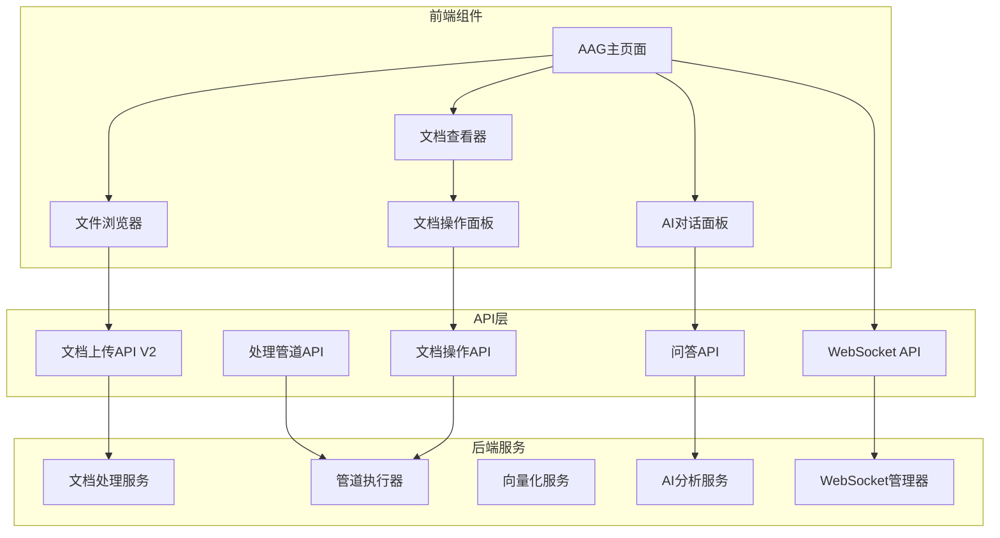

# AAG页面功能组件分析报告

## 1. 总体架构

AAG（Advanced Analysis & Generation）页面是DPA系统的核心界面，提供文档管理、智能分析和AI对话功能。采用三栏布局设计：

```
┌─────────────────┬──────────────────────┬─────────────────┐
│  文件浏览器      │    文档查看器         │   AI对话面板    │
│  (FileExplorer) │ (DocumentViewer)     │   (AIChat)      │
└─────────────────┴──────────────────────┴─────────────────┘
```

## 2. 核心组件清单

### 2.1 主页面组件 (page.tsx)
- **位置**: `/frontend/src/app/aag/page.tsx`
- **功能**: 
  - 管理整体页面状态和布局
  - 协调各子组件之间的通信
  - 处理WebSocket连接和实时更新
  - 管理文件上传和处理流程

### 2.2 文件浏览器组件 (FileExplorer)
- **位置**: `/frontend/src/components/aag/FileExplorer.tsx`
- **核心功能**:
  - 文件树展示（支持文件夹展开/折叠）
  - 文件搜索和过滤
  - 文件上传（支持拖拽）
  - 右键菜单（下载、删除）
  - 处理选项配置（4个处理选项）
  - 上传进度显示
  - 处理管道进度可视化

### 2.3 文档查看器组件 (EnhancedDocumentViewer)
- **位置**: `/frontend/src/components/aag/EnhancedDocumentViewer.tsx`
- **核心功能**:
  - 多标签页文档查看
  - 文档内容搜索
  - 缩放控制（50%-200%）
  - 下载和打印功能
  - 文档操作面板（可调整宽度）

### 2.4 文档操作组件 (DocumentActions)
- **位置**: `/frontend/src/components/aag/DocumentActions.tsx`
- **三大操作**:
  1. **生成摘要** - 快速提取文档核心内容
  2. **创建索引** - 建立文档索引支持快速搜索
  3. **深度分析** - 深入分析文档提取洞察

### 2.5 AI对话组件 (AIChat)
- **位置**: `/frontend/src/components/aag/AIChat.tsx`
- **核心功能**:
  - 多对话管理
  - 实时消息发送/接收
  - 文档上下文关联
  - 语音输入支持
  - 附件管理
  - 位置切换（右侧/底部）

## 3. API端点映射

### 3.1 文档上传API (V2)
```typescript
// 端点: POST /api/v2/documents/upload
// 服务: documentServiceV2.uploadDocument()
// 功能: 文档上传并触发处理管道
// 参数:
{
  file: File,
  upload_only: boolean,      // 仅上传
  generate_summary: boolean, // 生成摘要
  create_index: boolean,     // 创建索引
  deep_analysis: boolean,    // 深度分析
  project_id?: string
}
```

### 3.2 处理管道进度API
```typescript
// 端点: GET /api/v2/documents/{document_id}/pipeline/{pipeline_id}/progress
// 服务: documentServiceV2.getProcessingProgress()
// 功能: 获取处理管道实时进度
```

### 3.3 管道控制API
```typescript
// 中断处理
// 端点: POST /api/v2/documents/{document_id}/pipeline/{pipeline_id}/interrupt
// 服务: documentServiceV2.interruptProcessing()

// 恢复处理
// 端点: POST /api/v2/documents/{document_id}/pipeline/{pipeline_id}/resume
// 服务: documentServiceV2.resumeProcessing()
```

### 3.4 文档操作API
```typescript
// 启动文档操作
// 端点: POST /api/v1/documents/{document_id}/operations/start
// 服务: documentServiceV2.startProcessing()

// 获取操作状态
// 端点: GET /api/v1/documents/{document_id}/operations/status
// 服务: documentServiceV2.getOperationStatus()

// 执行单个操作
// 端点: POST /api/v1/documents/{document_id}/operations/{operation}/execute
// 服务: documentServiceV2.executeSingleOperation()
// 操作类型: summary | index | analysis
```

### 3.5 文档列表API
```typescript
// 端点: GET /api/v1/documents
// 服务: documentServiceV2.getDocuments()
// 参数: project_id, limit, offset
```

### 3.6 WebSocket API
```typescript
// 端点: ws://localhost:8200/api/v1/ws/{user_id}
// 服务: webSocketService
// 功能:
// - 实时进度推送
// - 管道状态更新
// - 双向通信支持
```

### 3.7 问答API (增强版)
```typescript
// 端点: POST /api/v1/enhanced-qa/answer
// 功能: 记忆增强的问答系统
// 参数:
{
  question: string,
  project_id: string,
  user_id: string,
  conversation_id?: string,
  use_memory: boolean,
  include_context: boolean
}
```

## 4. 功能架构图



## 5. 数据流分析

### 5.1 文档上传流程
1. 用户选择文件 → FileExplorer组件
2. 配置处理选项（4个checkbox）
3. 调用uploadDocument API
4. 后端创建处理管道
5. WebSocket订阅进度更新
6. 实时显示处理进度
7. 完成后更新文件树

### 5.2 文档操作流程
1. 选择文档 → DocumentViewer显示
2. DocumentActions面板显示可用操作
3. 点击操作按钮（摘要/索引/分析）
4. 调用相应的操作API
5. WebSocket推送进度更新
6. 显示阶段详情和进度条
7. 完成后可查看结果

### 5.3 AI对话流程
1. 创建新对话或选择现有对话
2. 输入问题（可附加当前文档）
3. 发送到增强问答API
4. 后端使用记忆系统和向量检索
5. 返回答案和相关来源
6. 更新对话历史

## 6. 组件依赖关系

```
AAGPage (主页面)
├── FileExplorer (文件管理)
│   ├── 处理选项配置
│   ├── 上传进度显示
│   └── 文件树渲染
├── EnhancedDocumentViewer (文档查看)
│   ├── 标签页管理
│   ├── 内容显示
│   └── DocumentActions (操作面板)
│       ├── 摘要生成
│       ├── 索引创建
│       └── 深度分析
└── AIChat (AI助手)
    ├── 对话管理
    ├── 消息历史
    └── 上下文关联
```

## 7. 关键状态管理

### 7.1 页面级状态
- `selectedFile`: 当前选中的文件
- `openTabs`: 打开的文档标签页
- `activeTab`: 当前活动标签页
- `conversations`: 对话列表
- `activeConversation`: 当前活动对话
- `uploadingFile`: 上传中的文件信息
- `processingProgress`: 处理进度信息
- `wsConnected`: WebSocket连接状态

### 7.2 处理选项状态
```typescript
interface ProcessingOptions {
  upload_only: boolean;      // 默认true
  generate_summary: boolean; // 默认true
  create_index: boolean;     // 默认true
  deep_analysis: boolean;    // 默认false
}
```

## 8. 实时通信机制

### 8.1 WebSocket消息类型
- `pipeline_progress`: 管道进度更新
- `stage_update`: 阶段状态更新
- `subscribe_pipeline`: 订阅管道
- `unsubscribe_pipeline`: 取消订阅
- `ping/pong`: 心跳检测
- `get_status`: 获取连接状态

### 8.2 进度推送流程
1. 前端连接WebSocket
2. 文档上传后获得pipeline_id
3. 订阅该pipeline的进度
4. 后端推送实时进度
5. 前端更新UI显示
6. 完成后自动取消订阅

## 9. 核心功能总结

### 9.1 文档上传功能
- 支持PDF、DOCX、TXT、MD格式
- 可选择4种处理方式
- 实时进度显示
- 支持中断和恢复

### 9.2 文档摘要功能
- 快速提取关键信息
- 约30秒完成
- 结果保存到数据库

### 9.3 文档索引功能
- 创建向量索引
- 支持语义搜索
- 约2分钟完成

### 9.4 深度分析功能
- 六阶段分析方法
- 生成执行摘要
- 提供行动建议
- 约5分钟完成

## 10. 技术亮点

1. **模块化设计**: 组件职责明确，易于维护
2. **实时更新**: WebSocket保证进度实时推送
3. **中断恢复**: 支持长时间任务的中断和恢复
4. **记忆增强**: AI问答集成记忆系统
5. **可视化进度**: 详细的阶段进度展示
6. **灵活布局**: AI面板支持位置切换