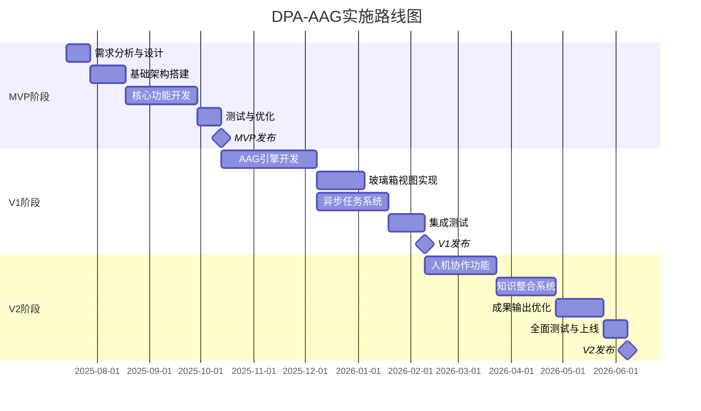

# DPA-AAG 实施规划与路线图

## 执行摘要

本文档详细规划了DPA-AAG（基于分析增强生成的智能文档处理系统）的实施路线，采用渐进式开发策略，分三个主要阶段在12个月内完成。每个阶段都有明确的目标、可交付成果和成功指标。

## 1. 总体时间线



## 2. 阶段详细规划

### 2.1 MVP阶段：智能阅读器（0-3月）

#### 目标
构建坚实的基础架构，验证核心AAG理念，提供基础但完整的文档智能处理能力。

#### 核心功能
1. **增强型文档处理**
   - 升级现有的文档上传和处理流程
   - 实现快速略读（Skim）功能
   - 优化分块策略（语义分块、结构化分块）

2. **基础分析能力**
   - 渐进式摘要（3个层级）
   - 多维大纲提取
   - 基础知识图谱构建

3. **元数据管理v2.0**
   - 实现新的元数据Schema
   - 分析物料的基础存储
   - 版本控制机制

#### 技术实施计划

##### 第1-2周：需求分析与架构设计
```python
# 主要任务
- 详细需求调研和用户访谈
- 技术选型确认（LangGraph版本、提示词优化策略）
- 数据库Schema设计评审
- API接口规范制定

# 交付物
- 需求规格说明书
- 技术架构设计文档
- 数据库设计文档
- API设计文档
```

##### 第3-5周：基础架构搭建
```python
# 数据库迁移脚本
alembic revision --autogenerate -m "Add AAG metadata tables v2"

# 核心模块结构
src/
├── aag/
│   ├── __init__.py
│   ├── agents/
│   │   ├── planner.py        # 规划代理
│   │   ├── skimmer.py        # 略读代理
│   │   └── analyzer.py       # 分析代理
│   ├── engines/
│   │   ├── execution.py      # 执行引擎
│   │   └── orchestration.py  # 任务编排
│   ├── prompts/
│   │   ├── templates.py      # 提示词模板
│   │   └── chains.py         # 提示词链
│   └── storage/
│       ├── artifacts.py      # 物料存储
│       └── metadata.py       # 元数据管理
```

##### 第6-11周：核心功能开发
```python
# 实现计划
Week 6-7: 快速略读功能
- 实现Skim Agent
- 集成到现有文档处理流程
- 性能优化（目标：P95 < 2s）

Week 8-9: 渐进式摘要
- 三层级摘要提示词优化
- 结果存储和版本管理
- API端点实现

Week 10-11: 大纲提取和知识图谱
- 多维大纲提取算法
- Neo4j集成优化
- 可视化接口设计
```

##### 第12-13周：测试与优化
```python
# 测试计划
- 单元测试覆盖率 > 80%
- 集成测试场景设计
- 性能基准测试
- 用户验收测试（UAT）

# 优化重点
- 提示词效果调优
- 响应时间优化
- 成本控制验证
```

#### 成功指标
- **功能指标**：
  - Skim功能响应时间 P95 ≤ 2秒
  - 摘要生成准确率 ≥ 85%
  - 知识图谱实体识别准确率 ≥ 80%
- **用户指标**：
  - 日活跃用户（DAU）≥ 50
  - 用户点击"深度分析"比例 ≥ 30%
  - 用户满意度评分 ≥ 4.0/5.0

#### 风险与缓解
| 风险 | 影响 | 缓解措施 |
|------|------|----------|
| LLM API不稳定 | 功能可用性降低 | 实现多模型切换机制 |
| 成本超预算 | 项目可持续性 | 严格的Token使用监控 |
| 用户采用率低 | 产品价值验证失败 | 早期用户深度访谈和快速迭代 |

### 2.2 V1阶段：分析师工作台（3-8月）

#### 目标
实现完整的AAG分析能力和"只读"玻璃箱模式，让用户能够看到AI的分析过程。

#### 核心功能
1. **深度分析引擎**
   - 证据链追踪
   - 交叉引用分析
   - 批判性思维框架
   - 假设检验工具

2. **玻璃箱视图（只读）**
   - 实时分析进度展示
   - 步骤日志流
   - 中间结果预览
   - 分析路径可视化

3. **异步任务系统**
   - 基于Celery的任务队列
   - 任务优先级管理
   - 资源使用监控
   - 失败重试机制

4. **分析物料库v1.0**
   - 结构化存储所有分析结果
   - 物料检索和复用
   - 版本管理和对比

#### 实施细节

##### 月3-4：AAG引擎开发
```python
# LangGraph分析图构建
from langgraph.graph import StateGraph
from langgraph.prebuilt import ToolExecutor, ToolInvocation

class AdvancedAnalysisGraph:
    def __init__(self):
        self.graph = StateGraph(AnalysisState)
        self.setup_nodes()
        self.setup_edges()
    
    def setup_nodes(self):
        # 分析节点
        self.graph.add_node("evidence_chain", self.evidence_chain_analysis)
        self.graph.add_node("cross_reference", self.cross_reference_analysis)
        self.graph.add_node("critical_thinking", self.critical_analysis)
        self.graph.add_node("hypothesis_testing", self.hypothesis_testing)
        
    def setup_edges(self):
        # 条件路由
        self.graph.add_conditional_edges(
            "evidence_chain",
            self.should_deep_dive,
            {
                True: "critical_thinking",
                False: "synthesis"
            }
        )

# Celery任务定义
@celery_app.task(bind=True, max_retries=3)
def execute_deep_analysis(self, document_id: str, analysis_config: dict):
    graph = AdvancedAnalysisGraph()
    state = AnalysisState(
        document_id=document_id,
        config=analysis_config,
        artifacts=[]
    )
    
    # 执行分析图
    for output in graph.stream(state):
        # 发送进度更新
        self.update_state(
            state='PROGRESS',
            meta={
                'current_node': output.node,
                'artifacts_generated': len(output.artifacts)
            }
        )
```

##### 月5：玻璃箱视图实现
```typescript
// React组件实现
const GlassBoxAnalysisView: React.FC = () => {
    const [analysisState, setAnalysisState] = useState<AnalysisState>();
    const [logs, setLogs] = useState<LogEntry[]>([]);
    
    // WebSocket连接
    useEffect(() => {
        const ws = new WebSocket(`${WS_URL}/analysis/${taskId}`);
        
        ws.onmessage = (event) => {
            const message = JSON.parse(event.data);
            
            switch (message.type) {
                case 'progress':
                    updateProgress(message.data);
                    break;
                case 'log':
                    appendLog(message.data);
                    break;
                case 'artifact':
                    displayArtifact(message.data);
                    break;
            }
        };
        
        return () => ws.close();
    }, [taskId]);
    
    return (
        <div className="glass-box-container">
            <AnalysisProgress steps={analysisSteps} current={currentStep} />
            <LogViewer logs={logs} />
            <ArtifactGallery artifacts={artifacts} />
        </div>
    );
};

// 分析步骤可视化
const AnalysisProgress: React.FC<{steps: Step[], current: number}> = ({
    steps, current
}) => {
    return (
        <div className="analysis-progress">
            {steps.map((step, index) => (
                <div 
                    key={step.id}
                    className={`step ${index === current ? 'active' : ''} 
                               ${index < current ? 'completed' : ''}`}
                >
                    <div className="step-icon">{step.icon}</div>
                    <div className="step-name">{step.name}</div>
                    <div className="step-status">{getStepStatus(step, index, current)}</div>
                </div>
            ))}
        </div>
    );
};
```

##### 月6-7：集成与优化
```python
# API端点实现
@router.post("/api/v1/documents/{document_id}/deep-analysis")
async def create_deep_analysis(
    document_id: str,
    request: DeepAnalysisRequest,
    background_tasks: BackgroundTasks,
    current_user: User = Depends(get_current_user)
):
    # 成本预估
    cost_estimate = cost_estimator.estimate(
        document_id=document_id,
        analysis_depth=request.depth,
        modules=request.selected_modules
    )
    
    if cost_estimate.estimated_cost > current_user.budget_remaining:
        raise HTTPException(
            status_code=402,
            detail="Insufficient credits for this analysis"
        )
    
    # 创建分析任务
    task = create_analysis_task(
        document_id=document_id,
        user_id=current_user.id,
        config=request.dict()
    )
    
    # 异步执行
    if request.execution_mode == "async":
        celery_task = execute_deep_analysis.delay(
            document_id=document_id,
            analysis_config=request.dict()
        )
        task.celery_task_id = celery_task.id
    else:
        # 同步执行with WebSocket
        background_tasks.add_task(
            execute_stepped_analysis,
            task_id=task.id,
            websocket_manager=ws_manager
        )
    
    return {
        "task_id": task.id,
        "estimated_cost": cost_estimate.estimated_cost,
        "estimated_time": cost_estimate.estimated_time,
        "status": "started"
    }
```

#### 成功指标
- **性能指标**：
  - 深度分析任务成功率 ≥ 90%
  - 平均分析时间 ≤ 5分钟（标准深度）
  - WebSocket连接稳定性 ≥ 99%
- **用户指标**：
  - 月活跃用户（MAU）≥ 200
  - 深度分析使用率 ≥ 40%
  - 用户满意度 ≥ 4.2/5.0
- **业务指标**：
  - 物料复用率 ≥ 30%
  - 平均每文档分析次数 ≥ 2.5

### 2.3 V2阶段：知识合成器（8-12月）

#### 目标
实现完整的人机协作功能，支持用户干预和个性化知识输出。

#### 核心功能
1. **交互式干预系统**
   - 分析过程暂停/恢复
   - 结果实时编辑
   - 参数动态调整
   - 路径选择引导

2. **记忆与学习系统**
   - 用户纠正记录
   - 个性化提示词优化
   - 领域知识积累
   - 偏好学习

3. **知识整合平台**
   - 跨文档分析
   - 主题综合报告
   - 比较研究工具
   - 知识图谱融合

4. **成果输出系统**
   - 多格式模板库
   - 自定义输出配置
   - 协作编辑功能
   - 版本管理

#### 实施计划

##### 月8-9：人机协作功能
```python
# 干预处理系统
class InterventionHandler:
    def __init__(self, task_id: str):
        self.task_id = task_id
        self.graph_state = self.load_graph_state()
        
    async def handle_intervention(self, intervention: UserIntervention):
        if intervention.type == "pause":
            await self.pause_execution()
        elif intervention.type == "modify":
            await self.modify_artifact(
                artifact_id=intervention.artifact_id,
                modifications=intervention.content
            )
        elif intervention.type == "parameter_change":
            await self.update_parameters(intervention.parameters)
        elif intervention.type == "path_selection":
            await self.select_execution_path(intervention.selected_path)
            
    async def pause_execution(self):
        # 保存当前状态
        self.graph_state.status = "paused"
        self.graph_state.checkpoint = self.create_checkpoint()
        await self.save_state()
        
    async def resume_execution(self, from_checkpoint: bool = True):
        if from_checkpoint:
            self.restore_checkpoint(self.graph_state.checkpoint)
        
        # 继续执行
        await self.graph.resume(self.graph_state)

# 前端干预界面
const InterventionPanel: React.FC<{
    currentArtifact: Artifact,
    onIntervene: (intervention: Intervention) => void
}> = ({ currentArtifact, onIntervene }) => {
    const [editMode, setEditMode] = useState(false);
    const [editedContent, setEditedContent] = useState(currentArtifact.content);
    
    const handleSaveEdit = () => {
        onIntervene({
            type: 'modify',
            artifact_id: currentArtifact.id,
            content: editedContent
        });
        setEditMode(false);
    };
    
    return (
        <Card className="intervention-panel">
            <CardHeader>
                <CardTitle>分析结果审查</CardTitle>
                <div className="intervention-controls">
                    <Button onClick={() => onIntervene({type: 'pause'})}>
                        暂停分析
                    </Button>
                    <Button onClick={() => setEditMode(true)}>
                        编辑结果
                    </Button>
                </div>
            </CardHeader>
            <CardContent>
                {editMode ? (
                    <ArtifactEditor
                        content={editedContent}
                        onChange={setEditedContent}
                        onSave={handleSaveEdit}
                    />
                ) : (
                    <ArtifactViewer artifact={currentArtifact} />
                )}
            </CardContent>
        </Card>
    );
};
```

##### 月10：记忆系统实现
```python
# 用户纠正知识库
class UserCorrectionKB:
    def __init__(self):
        self.corrections_index = self.init_vector_index()
        
    async def record_correction(
        self,
        user_id: str,
        document_id: str,
        original: str,
        corrected: str,
        context: dict
    ):
        correction = UserCorrection(
            user_id=user_id,
            document_id=document_id,
            original_content=original,
            corrected_content=corrected,
            context=context,
            timestamp=datetime.utcnow()
        )
        
        # 存储到数据库
        await self.save_correction(correction)
        
        # 更新向量索引
        embedding = await self.embed_correction(correction)
        self.corrections_index.add(
            correction.id,
            embedding,
            metadata=correction.dict()
        )
    
    async def retrieve_relevant_corrections(
        self,
        query: str,
        user_id: str,
        limit: int = 5
    ) -> List[UserCorrection]:
        # 检索相关的用户纠正
        results = self.corrections_index.search(
            query_embedding=await self.embed_text(query),
            filter={"user_id": user_id},
            limit=limit
        )
        
        return [self.load_correction(r.id) for r in results]

# 个性化提示词优化
class PersonalizedPromptOptimizer:
    def __init__(self, user_id: str):
        self.user_id = user_id
        self.correction_kb = UserCorrectionKB()
        
    async def optimize_prompt(
        self,
        base_prompt: str,
        context: dict
    ) -> str:
        # 获取相关的用户纠正
        corrections = await self.correction_kb.retrieve_relevant_corrections(
            query=context.get("current_task", ""),
            user_id=self.user_id
        )
        
        if corrections:
            # 构建增强提示词
            enhanced_prompt = f"{base_prompt}\n\n"
            enhanced_prompt += "基于用户的历史偏好和纠正：\n"
            
            for correction in corrections:
                enhanced_prompt += f"- {correction.summary}\n"
            
            enhanced_prompt += "\n请在分析时考虑这些要点。"
            
            return enhanced_prompt
        
        return base_prompt
```

##### 月11：知识整合功能
```python
# 跨文档分析引擎
class CrossDocumentAnalyzer:
    def __init__(self):
        self.synthesis_graph = self.build_synthesis_graph()
        
    def build_synthesis_graph(self):
        graph = StateGraph(SynthesisState)
        
        # 添加节点
        graph.add_node("collect_artifacts", self.collect_relevant_artifacts)
        graph.add_node("identify_themes", self.identify_common_themes)
        graph.add_node("compare_perspectives", self.compare_different_perspectives)
        graph.add_node("synthesize_insights", self.synthesize_insights)
        graph.add_node("generate_report", self.generate_comprehensive_report)
        
        # 设置流程
        graph.set_entry_point("collect_artifacts")
        graph.add_edge("collect_artifacts", "identify_themes")
        graph.add_edge("identify_themes", "compare_perspectives")
        graph.add_edge("compare_perspectives", "synthesize_insights")
        graph.add_edge("synthesize_insights", "generate_report")
        
        return graph.compile()
    
    async def analyze_document_set(
        self,
        document_ids: List[str],
        analysis_focus: str,
        output_format: str = "comprehensive_report"
    ):
        state = SynthesisState(
            document_ids=document_ids,
            focus=analysis_focus,
            artifacts=[]
        )
        
        async for output in self.synthesis_graph.astream(state):
            yield output

# 知识图谱融合
class KnowledgeGraphFusion:
    def __init__(self, neo4j_manager):
        self.neo4j = neo4j_manager
        
    async def merge_document_graphs(
        self,
        document_ids: List[str],
        merge_strategy: str = "entity_resolution"
    ):
        # 提取各文档的知识图谱
        graphs = []
        for doc_id in document_ids:
            graph = await self.neo4j.get_document_graph(doc_id)
            graphs.append(graph)
        
        # 实体解析和对齐
        if merge_strategy == "entity_resolution":
            aligned_entities = await self.resolve_entities_across_graphs(graphs)
            
        # 创建融合图谱
        merged_graph = await self.create_merged_graph(
            graphs=graphs,
            aligned_entities=aligned_entities
        )
        
        # 识别新的关系和模式
        new_insights = await self.discover_cross_document_patterns(merged_graph)
        
        return {
            "merged_graph": merged_graph,
            "new_insights": new_insights,
            "statistics": self.calculate_fusion_stats(graphs, merged_graph)
        }
```

##### 月12：成果输出优化
```python
# 模板化输出系统
class OutputTemplateEngine:
    def __init__(self):
        self.templates = self.load_templates()
        self.renderers = {
            "markdown": MarkdownRenderer(),
            "docx": DocxRenderer(),
            "pptx": PptxRenderer(),
            "pdf": PdfRenderer()
        }
    
    async def generate_output(
        self,
        artifacts: List[Artifact],
        template_name: str,
        output_format: str,
        custom_params: dict = None
    ):
        # 加载模板
        template = self.templates.get(template_name)
        if not template:
            raise ValueError(f"Template {template_name} not found")
        
        # 准备数据
        context = self.prepare_context(artifacts, custom_params)
        
        # 渲染内容
        content = await template.render(context)
        
        # 转换格式
        output = await self.renderers[output_format].render(content)
        
        return output

# 协作编辑支持
class CollaborativeEditor:
    def __init__(self, document_id: str):
        self.document_id = document_id
        self.y_doc = Y.Doc()  # Yjs document for CRDT
        self.active_users = {}
        
    async def handle_edit(self, user_id: str, edit: Edit):
        # 应用编辑
        self.y_doc.transact(lambda: edit.apply(self.y_doc))
        
        # 广播给其他用户
        await self.broadcast_change(user_id, edit)
        
        # 保存版本
        await self.save_version(user_id, edit)
```

#### 成功指标
- **功能指标**：
  - 用户干预响应时间 ≤ 500ms
  - 跨文档分析准确率 ≥ 85%
  - 输出格式转换成功率 ≥ 95%
- **用户指标**：
  - 月活跃用户（MAU）≥ 500
  - 物料复用率 ≥ 60%
  - NPS评分 ≥ 40
- **业务指标**：
  - 付费转化率 ≥ 15%
  - 用户月均分析量 ≥ 10次
  - 高级功能使用率 ≥ 50%

## 3. 技术债务管理

### 3.1 代码质量保证
- 代码审查：所有PR必须经过至少一位高级工程师审查
- 测试覆盖：单元测试覆盖率保持在80%以上
- 文档更新：每个新功能必须包含完整的API文档和使用示例

### 3.2 性能监控
```python
# 性能基准测试
performance_benchmarks = {
    "skim_analysis": {"p50": 1.0, "p95": 2.0, "p99": 3.0},  # 秒
    "deep_analysis": {"p50": 180, "p95": 300, "p99": 600},  # 秒
    "token_usage": {"avg": 5000, "max": 20000},  # per analysis
    "memory_usage": {"avg": 512, "max": 2048}  # MB
}

# 监控指标
monitoring_metrics = [
    "analysis_latency",
    "token_consumption",
    "error_rate",
    "user_satisfaction_score",
    "artifact_reuse_rate"
]
```

### 3.3 技术债务清单
| 优先级 | 债务项 | 影响 | 解决时间 |
|--------|--------|------|----------|
| 高 | 提示词版本管理 | 难以追踪和回滚 | MVP阶段 |
| 高 | 异步任务监控 | 故障定位困难 | V1阶段 |
| 中 | 多语言支持 | 国际化受限 | V2阶段 |
| 中 | 缓存优化 | 成本较高 | V1阶段 |
| 低 | UI组件库统一 | 开发效率 | V2阶段 |

## 4. 团队组织与资源

### 4.1 团队结构
```
产品负责人 (1)
├── 技术负责人 (1)
│   ├── 后端工程师 (2-3)
│   │   ├── LangGraph专家 (1)
│   │   └── API开发 (1-2)
│   ├── 前端工程师 (2)
│   │   ├── React专家 (1)
│   │   └── UI/UX实现 (1)
│   └── AI工程师 (1-2)
│       ├── 提示词工程 (1)
│       └── 模型优化 (1)
├── 设计师 (1)
└── QA工程师 (1)
```

### 4.2 技能要求
- **后端**：Python, FastAPI, LangGraph, Celery, PostgreSQL
- **前端**：TypeScript, React, Next.js, WebSocket
- **AI/ML**：LangChain, 提示词工程, 向量数据库
- **基础设施**：Docker, Kubernetes, 监控工具

### 4.3 外部依赖
- OpenAI API / Anthropic API
- 云服务提供商（AWS/GCP/Azure）
- 第三方监控服务（Datadog/New Relic）

## 5. 风险管理矩阵

| 风险类别 | 具体风险 | 概率 | 影响 | 缓解策略 |
|----------|----------|------|------|----------|
| 技术 | LLM API限流 | 中 | 高 | 多供应商策略+本地模型备份 |
| 技术 | 实时性能不达标 | 中 | 中 | 渐进式加载+缓存优化 |
| 业务 | 用户采用率低 | 低 | 高 | MVP快速验证+用户共创 |
| 成本 | Token费用超支 | 中 | 中 | 严格配额管理+成本预警 |
| 安全 | 数据泄露风险 | 低 | 高 | 加密存储+访问控制 |
| 团队 | 关键人员流失 | 低 | 中 | 知识文档化+交叉培训 |

## 6. 预算估算

### 6.1 开发成本（12个月）
- 人力成本：约 $600,000 - $800,000
- 基础设施：约 $60,000 - $100,000
- API使用费：约 $30,000 - $50,000
- 第三方服务：约 $20,000 - $30,000
- **总计**：约 $710,000 - $980,000

### 6.2 运营成本（月度）
- 服务器托管：$5,000 - $10,000
- API调用：$5,000 - $15,000
- 监控和安全：$2,000 - $3,000
- **月度总计**：$12,000 - $28,000

## 7. 成功标准与KPI

### 7.1 产品KPI
- **MVP (3个月)**
  - DAU ≥ 50
  - 文档处理成功率 ≥ 95%
  - 用户满意度 ≥ 4.0/5

- **V1 (8个月)**
  - MAU ≥ 200
  - 深度分析使用率 ≥ 40%
  - 物料复用率 ≥ 30%

- **V2 (12个月)**
  - MAU ≥ 500
  - 付费转化率 ≥ 15%
  - NPS ≥ 40

### 7.2 技术KPI
- API可用性 ≥ 99.5%
- P95延迟达标率 ≥ 90%
- 重大故障恢复时间 ≤ 2小时

## 8. 沟通与汇报机制

### 8.1 定期会议
- **日站会**：开发团队每日同步（15分钟）
- **周例会**：项目进度review（1小时）
- **月度回顾**：里程碑评估和规划调整（2小时）

### 8.2 文档规范
- 技术设计文档（TDD）
- API文档（OpenAPI规范）
- 用户手册和最佳实践
- 故障处理手册（Runbook）

### 8.3 发布流程
1. 功能开发完成 → 代码审查
2. 自动化测试 → 手动测试
3. Staging环境验证
4. 生产环境灰度发布
5. 全量发布和监控

## 结语

DPA-AAG项目通过分阶段实施策略，将在12个月内从一个基础的智能阅读器逐步演进为功能完整的认知增强平台。每个阶段都有明确的目标和可衡量的成功指标，确保项目能够稳健推进并持续为用户创造价值。

通过采用LangGraph作为核心编排引擎，结合渐进式的产品策略和严格的工程实践，我们有信心将AAG的理念成功落地，打造出真正能够增强人类认知能力的智能系统。