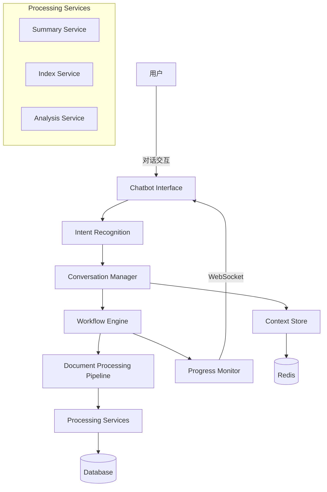

# Chatbot文档处理技术架构设计

## 1. 系统架构概览



## 2. 核心组件设计

### 2.1 Conversation Manager（对话管理器）
```python
class ConversationManager:
    """
    管理对话流程和上下文
    """
    def __init__(self):
        self.sessions = {}  # 活跃会话
        self.workflows = {}  # 工作流实例
        
    async def process_message(self, user_id: str, message: str):
        # 1. 获取或创建会话
        session = self.get_or_create_session(user_id)
        
        # 2. 意图识别
        intent = await self.recognize_intent(message, session.context)
        
        # 3. 执行相应动作
        response = await self.execute_action(session, intent)
        
        # 4. 更新上下文
        session.update_context(intent, response)
        
        return response
```

### 2.2 Workflow Engine（工作流引擎）
```python
class DocumentWorkflow:
    """
    文档处理工作流
    """
    def __init__(self, document_id: str, user_id: str):
        self.document_id = document_id
        self.user_id = user_id
        self.state = WorkflowState.INITIALIZED
        self.stages = self._build_stages()
        self.current_stage = None
        
    def _build_stages(self):
        return [
            Stage("upload_complete", self.handle_upload_complete),
            Stage("summary", self.handle_summary, interruptible=True),
            Stage("index", self.handle_index, interruptible=True),
            Stage("analysis", self.handle_analysis, interruptible=True),
            Stage("complete", self.handle_complete)
        ]
        
    async def start(self):
        """启动工作流"""
        await self.transition_to("upload_complete")
        
    async def interrupt(self):
        """中断当前阶段"""
        if self.current_stage and self.current_stage.interruptible:
            await self.current_stage.interrupt()
            self.state = WorkflowState.INTERRUPTED
            
    async def resume(self, user_input=None):
        """恢复工作流"""
        if self.state == WorkflowState.INTERRUPTED:
            await self.current_stage.resume(user_input)
            self.state = WorkflowState.RUNNING
```

### 2.3 Intent Recognition（意图识别）
```python
class IntentRecognizer:
    """
    基于规则和AI的意图识别
    """
    def __init__(self):
        self.intent_patterns = {
            "summary": ["摘要", "总结", "概要", "主要内容", "讲了什么"],
            "index": ["索引", "搜索", "检索", "查找"],
            "analyze": ["分析", "深入", "详细", "洞察", "研究"],
            "status": ["状态", "进度", "怎么样了", "完成了吗"],
            "interrupt": ["停", "暂停", "等一下", "取消", "中断"],
            "continue": ["继续", "接着", "恢复", "go on"],
            "help": ["帮助", "怎么用", "做什么", "功能"]
        }
        
    async def recognize(self, message: str, context: dict):
        # 1. 规则匹配
        rule_based = self._rule_based_match(message)
        
        # 2. 上下文相关识别
        context_based = self._context_based_match(message, context)
        
        # 3. AI增强识别（如果需要）
        if not rule_based and not context_based:
            ai_based = await self._ai_based_match(message, context)
            return ai_based
            
        return rule_based or context_based
```

## 3. 对话流程状态机

```python
from enum import Enum

class ConversationState(Enum):
    IDLE = "idle"
    PROCESSING_SELECTION = "processing_selection"
    SUMMARY_IN_PROGRESS = "summary_in_progress"
    SUMMARY_REVIEW = "summary_review"
    INDEX_IN_PROGRESS = "index_in_progress"
    INDEX_REVIEW = "index_review"
    ANALYSIS_CONFIG = "analysis_config"
    ANALYSIS_IN_PROGRESS = "analysis_in_progress"
    ANALYSIS_REVIEW = "analysis_review"
    WORKFLOW_COMPLETE = "workflow_complete"
    INTERRUPTED = "interrupted"

class ConversationStateMachine:
    """
    对话状态机
    """
    transitions = {
        ConversationState.IDLE: [
            ConversationState.PROCESSING_SELECTION
        ],
        ConversationState.PROCESSING_SELECTION: [
            ConversationState.SUMMARY_IN_PROGRESS,
            ConversationState.INDEX_IN_PROGRESS,
            ConversationState.ANALYSIS_CONFIG
        ],
        ConversationState.SUMMARY_IN_PROGRESS: [
            ConversationState.SUMMARY_REVIEW,
            ConversationState.INTERRUPTED
        ],
        # ... 其他状态转换
    }
    
    def can_transition(self, from_state, to_state):
        return to_state in self.transitions.get(from_state, [])
```

## 4. 实时进度推送设计

### 4.1 WebSocket消息格式
```typescript
interface ProgressMessage {
    type: 'progress' | 'stage_complete' | 'error' | 'interrupt'
    stage: string
    progress: number
    message: string
    details?: {
        current_step?: string
        total_steps?: number
        estimates?: {
            time_elapsed: number
            time_remaining: number
        }
        preview?: any  // 阶段性结果预览
    }
}
```

### 4.2 进度推送服务
```python
class ProgressNotifier:
    """
    进度通知服务
    """
    def __init__(self, websocket_manager):
        self.ws_manager = websocket_manager
        
    async def notify_progress(self, user_id: str, progress_data: dict):
        await self.ws_manager.send_to_user(user_id, {
            "type": "progress",
            "data": progress_data
        })
        
    async def stream_result(self, user_id: str, result_generator):
        """流式推送结果"""
        async for chunk in result_generator:
            await self.ws_manager.send_to_user(user_id, {
                "type": "stream",
                "data": chunk
            })
```

## 5. 上下文管理设计

### 5.1 会话上下文结构
```python
class SessionContext:
    """
    会话上下文
    """
    def __init__(self, user_id: str):
        self.user_id = user_id
        self.document_id = None
        self.workflow_id = None
        self.current_state = ConversationState.IDLE
        self.history = []  # 对话历史
        self.preferences = {}  # 用户偏好
        self.interruption_point = None  # 中断点信息
        self.custom_parameters = {}  # 自定义参数
        
    def to_dict(self):
        return {
            "user_id": self.user_id,
            "document_id": self.document_id,
            "workflow_id": self.workflow_id,
            "current_state": self.current_state.value,
            "preferences": self.preferences,
            "custom_parameters": self.custom_parameters
        }
```

### 5.2 上下文持久化
```python
class ContextStore:
    """
    上下文存储（Redis）
    """
    def __init__(self, redis_client):
        self.redis = redis_client
        self.ttl = 3600  # 1小时过期
        
    async def save_context(self, session_id: str, context: SessionContext):
        await self.redis.setex(
            f"session:{session_id}",
            self.ttl,
            json.dumps(context.to_dict())
        )
        
    async def get_context(self, session_id: str) -> SessionContext:
        data = await self.redis.get(f"session:{session_id}")
        if data:
            return SessionContext.from_dict(json.loads(data))
        return None
```

## 6. API设计

### 6.1 Chatbot对话API
```python
@router.post("/api/v1/chatbot/message")
async def process_message(
    message: str,
    session_id: Optional[str] = None,
    document_id: Optional[str] = None,
    user_id: str = Depends(get_current_user)
):
    """处理用户消息"""
    # 1. 获取或创建会话
    # 2. 处理消息
    # 3. 返回响应和新状态
    
@router.post("/api/v1/chatbot/interrupt")
async def interrupt_workflow(
    session_id: str,
    user_id: str = Depends(get_current_user)
):
    """中断当前工作流"""
    
@router.post("/api/v1/chatbot/resume")
async def resume_workflow(
    session_id: str,
    user_input: Optional[str] = None,
    user_id: str = Depends(get_current_user)
):
    """恢复工作流"""
```

### 6.2 工作流状态API
```python
@router.get("/api/v1/chatbot/workflow/{workflow_id}/status")
async def get_workflow_status(
    workflow_id: str,
    user_id: str = Depends(get_current_user)
):
    """获取工作流状态"""
    
@router.get("/api/v1/chatbot/session/{session_id}/history")
async def get_session_history(
    session_id: str,
    user_id: str = Depends(get_current_user)
):
    """获取会话历史"""
```

## 7. 前端集成设计

### 7.1 Chatbot组件增强
```typescript
interface ChatbotProps {
    documentId?: string
    onWorkflowStart?: (workflowId: string) => void
    onWorkflowComplete?: (result: any) => void
    onStageChange?: (stage: string, progress: number) => void
}

interface MessageAction {
    type: 'summary' | 'index' | 'analyze' | 'interrupt' | 'custom'
    label: string
    action: () => void
    disabled?: boolean
}

interface ChatMessage {
    id: string
    type: 'user' | 'assistant' | 'system'
    content: string
    timestamp: Date
    actions?: MessageAction[]  // 可操作按钮
    progress?: ProgressInfo    // 进度信息
    preview?: any             // 预览数据
}
```

### 7.2 实时更新Hook
```typescript
const useDocumentWorkflow = (documentId: string) => {
    const [workflowState, setWorkflowState] = useState<WorkflowState>()
    const [progress, setProgress] = useState<ProgressInfo>()
    
    useEffect(() => {
        // 连接WebSocket
        const ws = connectWebSocket()
        
        ws.on('progress', (data) => {
            setProgress(data)
        })
        
        ws.on('stage_complete', (data) => {
            setWorkflowState(data.nextStage)
        })
        
        return () => ws.close()
    }, [documentId])
    
    return { workflowState, progress }
}
```

## 8. 智能提示系统

### 8.1 动态提示生成
```python
class SmartSuggestions:
    """
    智能提示生成器
    """
    def __init__(self):
        self.suggestion_templates = {
            "post_upload": [
                "您想先了解文档的主要内容吗？",
                "需要我帮您快速生成摘要吗？",
                "这个文档有{page_count}页，建议先创建索引以便快速查找"
            ],
            "post_summary": [
                "摘要显示这是关于{topic}的文档，需要深入分析吗？",
                "发现{keyword_count}个关键概念，要创建知识图谱吗？",
                "要基于摘要生成执行建议吗？"
            ]
        }
        
    async def generate_suggestions(self, context: SessionContext, stage_result: dict):
        template_key = f"post_{context.current_stage}"
        templates = self.suggestion_templates.get(template_key, [])
        
        # 基于结果填充模板
        suggestions = []
        for template in templates:
            suggestion = template.format(**stage_result)
            suggestions.append(suggestion)
            
        return suggestions
```

## 9. 性能优化策略

### 9.1 缓存设计
- **结果缓存**：缓存摘要、索引等结果，避免重复处理
- **意图缓存**：缓存常见问题的意图识别结果
- **会话缓存**：使用Redis缓存活跃会话

### 9.2 异步处理
- **非阻塞处理**：所有长时间操作异步执行
- **并行处理**：可并行的任务同时进行
- **流式响应**：大结果分块返回

### 9.3 资源管理
- **连接池**：数据库和Redis连接池
- **任务队列**：使用Celery管理后台任务
- **限流保护**：防止单用户过度使用资源

## 10. 安全和隐私

### 10.1 权限控制
- 用户只能操作自己的文档
- 敏感操作需要二次确认
- 操作日志完整记录

### 10.2 数据保护
- 对话历史加密存储
- 敏感信息脱敏处理
- 定期清理过期数据

## 11. 监控和分析

### 11.1 关键指标
- **响应时间**：对话响应延迟
- **完成率**：工作流完成比例
- **中断率**：用户中断操作的频率
- **满意度**：基于用户反馈

### 11.2 日志设计
```python
{
    "timestamp": "2024-01-15T10:30:00Z",
    "user_id": "u123",
    "session_id": "s456",
    "event_type": "workflow_stage_complete",
    "stage": "summary",
    "duration": 28.5,
    "success": true,
    "metadata": {
        "document_id": "d789",
        "result_quality": 0.92
    }
}
```