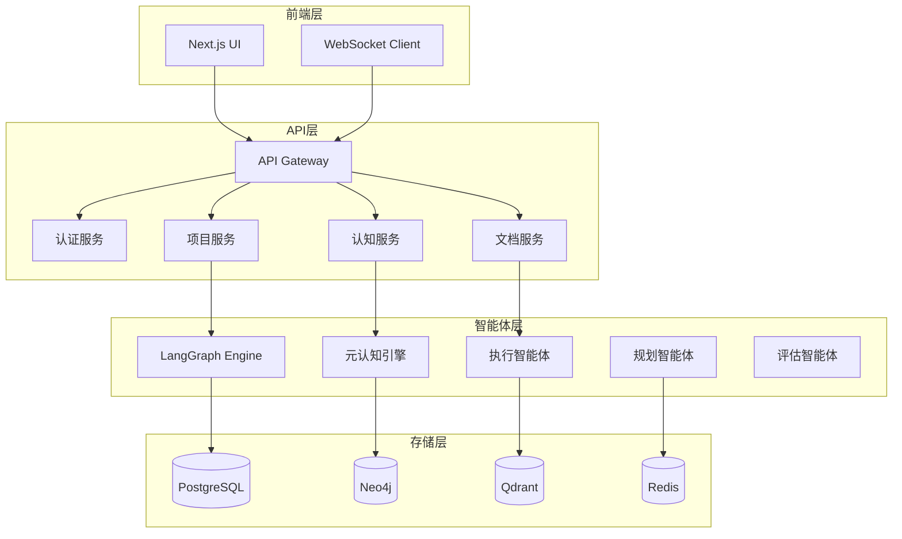

# DPA Next 技术设计文档

## 1. 系统架构概述

### 1.1 架构原则
- **模块化设计**：每个功能模块独立可测试、可扩展
- **事件驱动**：基于LangGraph的状态机和消息传递
- **混合存储**：不同类型数据使用最适合的存储方案
- **渐进式增强**：从MVP到完整系统的平滑演进

### 1.2 技术栈选择

```yaml
核心框架:
  - Python: 3.11+
  - LangGraph: 0.4.8 (工作流编排)
  - LangChain: 0.3.26 (AI工具链)
  - FastAPI: 0.115.13 (API框架)

存储层:
  - PostgreSQL: 项目元数据、检查点
  - Neo4j: 知识图谱
  - Qdrant: 向量存储
  - Redis: 缓存和会话

前端技术:
  - Next.js 15.3 (React框架)
  - TypeScript: 类型安全
  - TailwindCSS: 样式框架
  - Zustand: 状态管理
```

### 1.3 系统架构图



## 2. 核心模块设计

### 2.1 项目生命周期管理

#### 2.1.1 数据模型

```python
# PostgreSQL Schema
class Project(Base):
    __tablename__ = "projects"
    
    id = Column(UUID, primary_key=True, default=uuid4)
    name = Column(String, nullable=False)
    description = Column(Text)
    type = Column(Enum(ProjectType))
    status = Column(Enum(ProjectStatus))
    
    # 项目配置
    config = Column(JSONB, default={})
    template_id = Column(UUID, ForeignKey("project_templates.id"))
    
    # 时间戳
    created_at = Column(DateTime, default=datetime.utcnow)
    updated_at = Column(DateTime, onupdate=datetime.utcnow)
    completed_at = Column(DateTime, nullable=True)
    
    # 关系
    user_id = Column(UUID, ForeignKey("users.id"))
    tasks = relationship("Task", back_populates="project")
    memories = relationship("ProjectMemory", back_populates="project")


class Task(Base):
    __tablename__ = "tasks"
    
    id = Column(UUID, primary_key=True, default=uuid4)
    project_id = Column(UUID, ForeignKey("projects.id"))
    parent_id = Column(UUID, ForeignKey("tasks.id"), nullable=True)
    
    title = Column(String, nullable=False)
    description = Column(Text)
    type = Column(Enum(TaskType))
    status = Column(Enum(TaskStatus))
    priority = Column(Integer, default=0)
    
    # 执行计划
    plan = Column(JSONB)
    dependencies = Column(ARRAY(UUID))
    
    # 执行结果
    result = Column(JSONB)
    quality_score = Column(Float)
    execution_time = Column(Float)
    
    # 时间戳
    created_at = Column(DateTime, default=datetime.utcnow)
    started_at = Column(DateTime)
    completed_at = Column(DateTime)
    
    # 关系
    project = relationship("Project", back_populates="tasks")
    children = relationship("Task", backref=backref("parent", remote_side=[id]))
    snapshots = relationship("TaskSnapshot", back_populates="task")
```

#### 2.1.2 状态机设计

```python
from langgraph.graph import StateGraph, START, END
from typing import TypedDict, List, Dict, Any

class ProjectState(TypedDict):
    """项目执行状态"""
    project_id: str
    current_phase: str  # requirements|planning|execution|recording|completion
    tasks: List[Dict[str, Any]]
    active_tasks: List[str]
    completed_tasks: List[str]
    blocked_tasks: List[str]
    
    # 上下文信息
    project_context: Dict[str, Any]
    user_preferences: Dict[str, Any]
    quality_gates: Dict[str, float]
    
    # 执行追踪
    execution_log: List[Dict[str, Any]]
    error_log: List[Dict[str, Any]]
    metrics: Dict[str, float]


def create_project_workflow() -> StateGraph:
    """创建项目工作流"""
    workflow = StateGraph(ProjectState)
    
    # 添加节点
    workflow.add_node("analyze_requirements", analyze_requirements)
    workflow.add_node("create_plan", create_plan)
    workflow.add_node("validate_plan", validate_plan)
    workflow.add_node("execute_task", execute_task)
    workflow.add_node("monitor_progress", monitor_progress)
    workflow.add_node("evaluate_quality", evaluate_quality)
    workflow.add_node("record_results", record_results)
    workflow.add_node("complete_project", complete_project)
    
    # 添加边
    workflow.add_edge(START, "analyze_requirements")
    workflow.add_edge("analyze_requirements", "create_plan")
    workflow.add_edge("create_plan", "validate_plan")
    
    # 条件边
    workflow.add_conditional_edges(
        "validate_plan",
        lambda x: "execute_task" if x["tasks"] else "create_plan",
        {
            "execute_task": "execute_task",
            "create_plan": "create_plan"
        }
    )
    
    # 执行循环
    workflow.add_edge("execute_task", "monitor_progress")
    workflow.add_conditional_edges(
        "monitor_progress",
        determine_next_action,
        {
            "execute_task": "execute_task",
            "evaluate_quality": "evaluate_quality",
            "complete_project": "complete_project"
        }
    )
    
    workflow.add_edge("evaluate_quality", "record_results")
    workflow.add_edge("record_results", "execute_task")
    workflow.add_edge("complete_project", END)
    
    return workflow.compile()
```

### 2.2 三层记忆系统

#### 2.2.1 记忆模型设计

```python
# Neo4j Schema (Cypher)
"""
// 工作记忆节点
CREATE (wm:WorkingMemory {
    session_id: $session_id,
    user_id: $user_id,
    context: $context,
    active_intents: $intents,
    created_at: datetime(),
    expires_at: datetime() + duration('PT4H')
})

// 任务记忆节点
CREATE (tm:TaskMemory {
    task_id: $task_id,
    project_id: $project_id,
    state: $state,
    decisions: $decisions,
    learnings: $learnings,
    created_at: datetime()
})

// 项目记忆节点
CREATE (pm:ProjectMemory {
    project_id: $project_id,
    knowledge_graph: $graph,
    insights: $insights,
    patterns: $patterns,
    created_at: datetime()
})

// 关系定义
CREATE (wm)-[:REFERENCES]->(tm)
CREATE (tm)-[:BELONGS_TO]->(pm)
CREATE (pm)-[:DERIVED_FROM]->(doc:Document)
"""

class MemoryManager:
    """三层记忆管理器"""
    
    def __init__(self):
        self.redis = RedisCache()
        self.neo4j = Neo4jManager()
        self.postgres = PostgresManager()
    
    async def update_working_memory(
        self,
        session_id: str,
        context: Dict[str, Any]
    ) -> None:
        """更新工作记忆"""
        # Redis中存储活跃会话
        await self.redis.set_cached(
            f"wm:{session_id}",
            {
                "context": context,
                "updated_at": datetime.now(),
                "ttl": 14400  # 4小时
            },
            cache_type="working_memory"
        )
        
        # Neo4j中记录引用关系
        await self.neo4j.execute_query("""
            MERGE (wm:WorkingMemory {session_id: $session_id})
            SET wm.context = $context,
                wm.updated_at = datetime()
        """, session_id=session_id, context=json.dumps(context))
    
    async def persist_task_memory(
        self,
        task_id: str,
        snapshot: Dict[str, Any]
    ) -> None:
        """持久化任务记忆"""
        # PostgreSQL中存储快照
        await self.postgres.save_task_snapshot(task_id, snapshot)
        
        # Neo4j中建立关系
        await self.neo4j.execute_query("""
            MERGE (tm:TaskMemory {task_id: $task_id})
            SET tm.latest_snapshot = $snapshot,
                tm.updated_at = datetime()
        """, task_id=task_id, snapshot=json.dumps(snapshot))
    
    async def build_project_memory(
        self,
        project_id: str
    ) -> Dict[str, Any]:
        """构建项目记忆"""
        # 聚合所有任务记忆
        task_memories = await self.neo4j.execute_query("""
            MATCH (pm:ProjectMemory {project_id: $project_id})
            MATCH (tm:TaskMemory)-[:BELONGS_TO]->(pm)
            RETURN tm
        """, project_id=project_id)
        
        # 提取知识图谱
        knowledge_graph = await self._extract_knowledge_graph(task_memories)
        
        # 生成洞察
        insights = await self._generate_insights(knowledge_graph)
        
        return {
            "project_id": project_id,
            "knowledge_graph": knowledge_graph,
            "insights": insights,
            "created_at": datetime.now()
        }
```

### 2.3 文档智能处理

#### 2.3.1 S2语义分块优化

```python
class S2ChunkingConfig:
    """S2分块配置"""
    
    # 基础参数
    MIN_CHUNK_SIZE = 500
    MAX_CHUNK_SIZE = 2000
    TARGET_CHUNK_SIZE = 1000
    OVERLAP_SIZE = 200
    
    # 语义参数
    SEMANTIC_THRESHOLD = 0.7
    BOUNDARY_CONFIDENCE = 0.8
    
    # 文档类型配置
    DOCUMENT_CONFIGS = {
        "academic": {
            "min_size": 800,
            "max_size": 3000,
            "preserve_sections": True,
            "preserve_citations": True
        },
        "technical": {
            "min_size": 500,
            "max_size": 2000,
            "preserve_code_blocks": True,
            "preserve_tables": True
        },
        "business": {
            "min_size": 600,
            "max_size": 1500,
            "preserve_lists": True,
            "preserve_headers": True
        }
    }


class EnhancedS2Chunker(S2SemanticChunker):
    """增强的S2分块器"""
    
    async def chunk_with_rules(
        self,
        document: str,
        doc_type: str,
        rules: Dict[str, Any]
    ) -> List[S2Chunk]:
        """基于规则的智能分块"""
        # 1. 识别文档结构
        structure = await self._analyze_structure(document, doc_type)
        
        # 2. 应用文档类型特定规则
        config = S2ChunkingConfig.DOCUMENT_CONFIGS.get(
            doc_type,
            {"min_size": 500, "max_size": 2000}
        )
        
        # 3. 保护性分块
        protected_elements = await self._identify_protected_elements(
            document,
            structure,
            rules
        )
        
        # 4. 执行语义分块
        chunks = await self.chunk_document(
            document,
            metadata={"doc_type": doc_type, "structure": structure}
        )
        
        # 5. 后处理优化
        optimized_chunks = await self._post_process_chunks(
            chunks,
            protected_elements,
            config
        )
        
        return optimized_chunks
```

#### 2.3.2 文档学习笔记系统

```python
class DocumentLearningNote:
    """文档学习笔记"""
    
    def __init__(self, document_id: str):
        self.document_id = document_id
        self.auto_notes = {}
        self.user_notes = []
        self.key_concepts = []
        self.questions = []
        self.insights = []
    
    async def generate_auto_notes(
        self,
        chunks: List[S2Chunk],
        llm: ChatOpenAI
    ) -> Dict[str, Any]:
        """生成自动笔记"""
        # 1. 提取关键概念
        self.key_concepts = await self._extract_key_concepts(chunks, llm)
        
        # 2. 生成摘要
        summary = await self._generate_summary(chunks, llm)
        
        # 3. 识别重要问题
        self.questions = await self._identify_questions(chunks, llm)
        
        # 4. 提取洞察
        self.insights = await self._extract_insights(chunks, llm)
        
        self.auto_notes = {
            "summary": summary,
            "key_concepts": self.key_concepts,
            "questions": self.questions,
            "insights": self.insights,
            "generated_at": datetime.now()
        }
        
        return self.auto_notes
    
    def add_user_note(
        self,
        author: str,
        content: str,
        tags: List[str],
        reference: Optional[str] = None
    ) -> None:
        """添加用户笔记"""
        note = {
            "id": str(uuid4()),
            "author": author,
            "content": content,
            "tags": tags,
            "reference": reference,
            "created_at": datetime.now(),
            "votes": 0
        }
        self.user_notes.append(note)
    
    def merge_notes(self) -> Dict[str, Any]:
        """合并自动和用户笔记"""
        return {
            "document_id": self.document_id,
            "auto_notes": self.auto_notes,
            "user_notes": self.user_notes,
            "merged_concepts": self._merge_concepts(),
            "consensus_insights": self._find_consensus(),
            "open_questions": self._identify_open_questions()
        }
```

### 2.4 混合检索系统

#### 2.4.1 检索架构

```python
class HybridRetriever:
    """混合检索器"""
    
    def __init__(self):
        self.vector_store = QdrantManager()
        self.keyword_store = ElasticsearchManager()  # 或使用PostgreSQL全文搜索
        self.graph_store = Neo4jManager()
        self.reranker = CrossEncoderReranker()
    
    async def search(
        self,
        query: str,
        project_id: str,
        top_k: int = 20,
        filters: Optional[Dict] = None
    ) -> List[RetrievalResult]:
        """执行混合检索"""
        # 1. 并行执行三种检索
        vector_task = self._vector_search(query, project_id, top_k * 2)
        keyword_task = self._keyword_search(query, project_id, top_k * 2)
        graph_task = self._graph_search(query, project_id, top_k)
        
        vector_results, keyword_results, graph_results = await asyncio.gather(
            vector_task,
            keyword_task,
            graph_task
        )
        
        # 2. RRF融合
        fused_results = self._rrf_fusion([
            vector_results,
            keyword_results,
            graph_results
        ], weights=[0.4, 0.3, 0.3])
        
        # 3. Cross-Encoder重排
        reranked_results = await self.reranker.rerank(
            query,
            fused_results[:top_k * 3],
            top_k
        )
        
        # 4. 添加上下文
        final_results = await self._enrich_with_context(
            reranked_results,
            project_id
        )
        
        return final_results
    
    def _rrf_fusion(
        self,
        result_lists: List[List[RetrievalResult]],
        weights: List[float],
        k: int = 60
    ) -> List[RetrievalResult]:
        """Reciprocal Rank Fusion"""
        scores = {}
        
        for i, results in enumerate(result_lists):
            weight = weights[i]
            for rank, result in enumerate(results):
                doc_id = result.id
                if doc_id not in scores:
                    scores[doc_id] = {"score": 0, "result": result}
                # RRF公式
                scores[doc_id]["score"] += weight / (k + rank + 1)
        
        # 按分数排序
        sorted_results = sorted(
            scores.values(),
            key=lambda x: x["score"],
            reverse=True
        )
        
        return [item["result"] for item in sorted_results]
```

#### 2.4.2 重排器实现

```python
class CrossEncoderReranker:
    """Cross-Encoder重排器"""
    
    def __init__(self, model_name: str = "cross-encoder/ms-marco-MiniLM-L-12-v2"):
        from sentence_transformers import CrossEncoder
        self.model = CrossEncoder(model_name)
    
    async def rerank(
        self,
        query: str,
        results: List[RetrievalResult],
        top_k: int
    ) -> List[RetrievalResult]:
        """重排检索结果"""
        # 准备输入对
        pairs = [(query, result.content) for result in results]
        
        # 批量评分
        scores = await asyncio.to_thread(self.model.predict, pairs)
        
        # 结合原始分数
        for i, result in enumerate(results):
            # 加权组合：60% Cross-Encoder分数，40%原始分数
            result.final_score = 0.6 * scores[i] + 0.4 * result.score
        
        # 重新排序
        results.sort(key=lambda x: x.final_score, reverse=True)
        
        return results[:top_k]
```

### 2.5 智能生成系统

#### 2.5.1 自适应生成策略

```python
class AdaptiveGenerator:
    """自适应生成器"""
    
    def __init__(self):
        self.strategies = {
            "analytical": AnalyticalStrategy(),
            "creative": CreativeStrategy(),
            "structured": StructuredStrategy(),
            "conversational": ConversationalStrategy()
        }
        self.strategy_selector = StrategySelector()
    
    async def generate(
        self,
        task: Dict[str, Any],
        context: List[RetrievalResult],
        user_preferences: Dict[str, Any]
    ) -> GenerationResult:
        """自适应生成"""
        # 1. 选择策略
        strategy_name = await self.strategy_selector.select(
            task_type=task["type"],
            context_quality=self._assess_context_quality(context),
            user_preferences=user_preferences
        )
        
        strategy = self.strategies[strategy_name]
        
        # 2. 准备提示
        prompt = await strategy.prepare_prompt(task, context)
        
        # 3. 生成内容
        generation = await strategy.generate(prompt)
        
        # 4. 后处理
        processed = await self._post_process(
            generation,
            task["output_format"],
            task.get("constraints", {})
        )
        
        # 5. 添加引用
        with_citations = await self._add_citations(processed, context)
        
        return GenerationResult(
            content=with_citations,
            strategy=strategy_name,
            confidence=strategy.confidence,
            metadata={
                "task_id": task["id"],
                "context_used": len(context),
                "generation_time": datetime.now()
            }
        )
```

## 3. API设计

### 3.1 RESTful API

```yaml
openapi: 3.0.0
info:
  title: DPA Next API
  version: 1.0.0

paths:
  /api/v1/projects:
    post:
      summary: 创建项目
      requestBody:
        content:
          application/json:
            schema:
              $ref: '#/components/schemas/CreateProjectRequest'
      responses:
        201:
          content:
            application/json:
              schema:
                $ref: '#/components/schemas/Project'
    
  /api/v1/projects/{project_id}/tasks:
    post:
      summary: 创建任务
      parameters:
        - name: project_id
          in: path
          required: true
          schema:
            type: string
            format: uuid
      requestBody:
        content:
          application/json:
            schema:
              $ref: '#/components/schemas/CreateTaskRequest'
    
  /api/v1/projects/{project_id}/chat:
    post:
      summary: 项目对话
      requestBody:
        content:
          application/json:
            schema:
              type: object
              properties:
                message:
                  type: string
                context:
                  type: object
                
  /api/v1/cognitive/analyze:
    post:
      summary: 认知分析
      requestBody:
        content:
          application/json:
            schema:
              type: object
              properties:
                document_id:
                  type: string
                analysis_type:
                  type: string
                  enum: [deep, quick, comparative]
```

### 3.2 WebSocket API

```python
class ProjectWebSocket:
    """项目执行WebSocket"""
    
    def __init__(self):
        self.connections: Dict[str, WebSocket] = {}
        self.project_executors: Dict[str, ProjectExecutor] = {}
    
    async def connect(self, websocket: WebSocket, project_id: str):
        """建立连接"""
        await websocket.accept()
        self.connections[project_id] = websocket
        
        # 发送初始状态
        executor = self.project_executors.get(project_id)
        if executor:
            await websocket.send_json({
                "type": "state_update",
                "data": executor.get_state()
            })
    
    async def handle_message(
        self,
        project_id: str,
        message: Dict[str, Any]
    ):
        """处理消息"""
        msg_type = message.get("type")
        
        if msg_type == "start_execution":
            await self._start_execution(project_id)
        elif msg_type == "pause_execution":
            await self._pause_execution(project_id)
        elif msg_type == "update_task":
            await self._update_task(project_id, message["data"])
        elif msg_type == "query":
            await self._handle_query(project_id, message["data"])
    
    async def broadcast_update(
        self,
        project_id: str,
        update: Dict[str, Any]
    ):
        """广播更新"""
        websocket = self.connections.get(project_id)
        if websocket:
            await websocket.send_json({
                "type": "execution_update",
                "timestamp": datetime.now().isoformat(),
                "data": update
            })
```

## 4. 部署架构

### 4.1 容器化设计

```dockerfile
# backend.dockerfile
FROM python:3.11-slim

WORKDIR /app

# 安装系统依赖
RUN apt-get update && apt-get install -y \
    build-essential \
    git \
    && rm -rf /var/lib/apt/lists/*

# 安装Python依赖
COPY requirements.txt .
RUN pip install --no-cache-dir -r requirements.txt

# 复制代码
COPY src/ ./src/
COPY scripts/ ./scripts/

# 设置环境变量
ENV PYTHONPATH=/app
ENV PYTHONUNBUFFERED=1

# 健康检查
HEALTHCHECK --interval=30s --timeout=10s --retries=3 \
    CMD python -c "import requests; requests.get('http://localhost:8000/health')"

# 启动命令
CMD ["uvicorn", "src.api.main:app", "--host", "0.0.0.0", "--port", "8000"]
```

### 4.2 Kubernetes部署

```yaml
# dpa-deployment.yaml
apiVersion: apps/v1
kind: Deployment
metadata:
  name: dpa-backend
  namespace: dpa
spec:
  replicas: 3
  selector:
    matchLabels:
      app: dpa-backend
  template:
    metadata:
      labels:
        app: dpa-backend
    spec:
      containers:
      - name: backend
        image: dpa/backend:latest
        ports:
        - containerPort: 8000
        env:
        - name: DATABASE_URL
          valueFrom:
            secretKeyRef:
              name: dpa-secrets
              key: database-url
        - name: REDIS_URL
          valueFrom:
            secretKeyRef:
              name: dpa-secrets
              key: redis-url
        resources:
          requests:
            memory: "512Mi"
            cpu: "500m"
          limits:
            memory: "2Gi"
            cpu: "2000m"
        livenessProbe:
          httpGet:
            path: /health
            port: 8000
          initialDelaySeconds: 30
          periodSeconds: 10
        readinessProbe:
          httpGet:
            path: /ready
            port: 8000
          initialDelaySeconds: 5
          periodSeconds: 5
---
apiVersion: v1
kind: Service
metadata:
  name: dpa-backend-service
  namespace: dpa
spec:
  selector:
    app: dpa-backend
  ports:
  - protocol: TCP
    port: 80
    targetPort: 8000
  type: LoadBalancer
```

### 4.3 监控和可观测性

```python
# 监控配置
from opentelemetry import trace
from opentelemetry.exporter.otlp.proto.grpc.trace_exporter import OTLPSpanExporter
from opentelemetry.instrumentation.fastapi import FastAPIInstrumentor
from prometheus_client import Counter, Histogram, Gauge

# Prometheus指标
request_count = Counter(
    'dpa_http_requests_total',
    'Total HTTP requests',
    ['method', 'endpoint', 'status']
)

request_duration = Histogram(
    'dpa_http_request_duration_seconds',
    'HTTP request duration',
    ['method', 'endpoint']
)

active_projects = Gauge(
    'dpa_active_projects',
    'Number of active projects'
)

memory_usage = Gauge(
    'dpa_memory_usage_bytes',
    'Memory usage by component',
    ['component']
)

# OpenTelemetry追踪
tracer = trace.get_tracer(__name__)

@app.middleware("http")
async def add_tracing(request: Request, call_next):
    with tracer.start_as_current_span(
        f"{request.method} {request.url.path}",
        attributes={
            "http.method": request.method,
            "http.url": str(request.url),
            "http.scheme": request.url.scheme,
        }
    ) as span:
        response = await call_next(request)
        span.set_attribute("http.status_code", response.status_code)
        return response
```

## 5. 性能优化

### 5.1 缓存策略

```python
class CacheStrategy:
    """多级缓存策略"""
    
    # L1: 进程内缓存（LRU）
    PROCESS_CACHE = LRUCache(maxsize=1000)
    
    # L2: Redis缓存
    REDIS_CACHE = RedisCache()
    
    # L3: CDN缓存（静态资源）
    CDN_CACHE = CloudflareCDN()
    
    @staticmethod
    async def get_with_cache(
        key: str,
        fetch_func: Callable,
        ttl: int = 3600
    ) -> Any:
        """多级缓存获取"""
        # L1查找
        if value := CacheStrategy.PROCESS_CACHE.get(key):
            return value
        
        # L2查找
        if value := await CacheStrategy.REDIS_CACHE.get(key):
            CacheStrategy.PROCESS_CACHE[key] = value
            return value
        
        # 获取新值
        value = await fetch_func()
        
        # 写入缓存
        CacheStrategy.PROCESS_CACHE[key] = value
        await CacheStrategy.REDIS_CACHE.set(key, value, ttl)
        
        return value
```

### 5.2 并发优化

```python
class ConcurrencyOptimizer:
    """并发优化器"""
    
    def __init__(self):
        # 连接池
        self.db_pool = create_async_pool(
            min_size=10,
            max_size=50,
            max_inactive_time=300
        )
        
        # 任务队列
        self.task_queue = asyncio.Queue(maxsize=1000)
        
        # 工作线程池
        self.executor = ThreadPoolExecutor(max_workers=20)
        
        # 信号量控制
        self.rate_limiter = asyncio.Semaphore(100)
    
    async def batch_process(
        self,
        items: List[Any],
        process_func: Callable,
        batch_size: int = 50
    ) -> List[Any]:
        """批量处理优化"""
        results = []
        
        for i in range(0, len(items), batch_size):
            batch = items[i:i + batch_size]
            
            # 并行处理批次
            batch_tasks = [
                self._process_with_limit(process_func, item)
                for item in batch
            ]
            
            batch_results = await asyncio.gather(*batch_tasks)
            results.extend(batch_results)
        
        return results
    
    async def _process_with_limit(self, func: Callable, item: Any) -> Any:
        """限流处理"""
        async with self.rate_limiter:
            return await func(item)
```

## 6. 安全设计

### 6.1 认证授权

```python
from fastapi_users import FastAPIUsers
from fastapi_users.authentication import JWTStrategy

class SecurityConfig:
    """安全配置"""
    
    # JWT配置
    JWT_SECRET = os.getenv("JWT_SECRET")
    JWT_LIFETIME_SECONDS = 3600
    JWT_ALGORITHM = "HS256"
    
    # OAuth2配置
    OAUTH2_PROVIDERS = {
        "google": GoogleOAuth2Client(
            client_id=os.getenv("GOOGLE_CLIENT_ID"),
            client_secret=os.getenv("GOOGLE_CLIENT_SECRET")
        ),
        "github": GithubOAuth2Client(
            client_id=os.getenv("GITHUB_CLIENT_ID"),
            client_secret=os.getenv("GITHUB_CLIENT_SECRET")
        )
    }
    
    # 权限配置
    PERMISSIONS = {
        "project.create": ["user", "admin"],
        "project.delete": ["owner", "admin"],
        "project.share": ["owner", "admin"],
        "cognitive.analyze": ["user", "admin"],
        "admin.panel": ["admin"]
    }


async def check_permission(
    user: User,
    resource: str,
    action: str
) -> bool:
    """检查权限"""
    permission = f"{resource}.{action}"
    allowed_roles = SecurityConfig.PERMISSIONS.get(permission, [])
    
    return user.role in allowed_roles
```

### 6.2 数据安全

```python
class DataSecurity:
    """数据安全"""
    
    @staticmethod
    def encrypt_sensitive_data(data: str) -> str:
        """加密敏感数据"""
        from cryptography.fernet import Fernet
        
        key = os.getenv("ENCRYPTION_KEY").encode()
        f = Fernet(key)
        return f.encrypt(data.encode()).decode()
    
    @staticmethod
    def sanitize_input(input_data: Dict[str, Any]) -> Dict[str, Any]:
        """输入净化"""
        import bleach
        
        sanitized = {}
        for key, value in input_data.items():
            if isinstance(value, str):
                # 清理HTML标签
                sanitized[key] = bleach.clean(value)
            elif isinstance(value, dict):
                sanitized[key] = DataSecurity.sanitize_input(value)
            else:
                sanitized[key] = value
        
        return sanitized
    
    @staticmethod
    def audit_log(
        user_id: str,
        action: str,
        resource: str,
        details: Dict[str, Any]
    ) -> None:
        """审计日志"""
        log_entry = {
            "timestamp": datetime.now(),
            "user_id": user_id,
            "action": action,
            "resource": resource,
            "details": details,
            "ip_address": get_client_ip(),
            "user_agent": get_user_agent()
        }
        
        # 写入审计日志
        audit_logger.info(json.dumps(log_entry))
```

## 7. 测试策略

### 7.1 单元测试

```python
import pytest
from unittest.mock import Mock, patch

class TestProjectWorkflow:
    """项目工作流测试"""
    
    @pytest.fixture
    def workflow(self):
        return create_project_workflow()
    
    @pytest.mark.asyncio
    async def test_analyze_requirements(self, workflow):
        """测试需求分析"""
        state = {
            "project_id": "test-123",
            "tasks": [],
            "project_context": {
                "goal": "研究竞品技术架构",
                "scope": "3个主要竞品"
            }
        }
        
        result = await workflow.nodes["analyze_requirements"](state)
        
        assert "requirements" in result
        assert len(result["requirements"]) > 0
        assert result["current_phase"] == "requirements"
    
    @pytest.mark.asyncio
    async def test_task_execution_success(self, workflow):
        """测试任务执行成功"""
        state = {
            "project_id": "test-123",
            "tasks": [
                {"id": "task-1", "status": "pending"},
                {"id": "task-2", "status": "pending"}
            ],
            "active_tasks": ["task-1"]
        }
        
        with patch("execute_task", return_value={"status": "completed"}):
            result = await workflow.nodes["execute_task"](state)
            
            assert "task-1" in result["completed_tasks"]
            assert "task-1" not in result["active_tasks"]
```

### 7.2 集成测试

```python
class TestAPIIntegration:
    """API集成测试"""
    
    @pytest.fixture
    async def client(self):
        async with AsyncClient(app=app, base_url="http://test") as ac:
            yield ac
    
    @pytest.mark.asyncio
    async def test_create_project_flow(self, client, auth_headers):
        """测试创建项目流程"""
        # 1. 创建项目
        response = await client.post(
            "/api/v1/projects",
            json={
                "name": "测试项目",
                "type": "research",
                "description": "研究AI技术趋势"
            },
            headers=auth_headers
        )
        assert response.status_code == 201
        project = response.json()
        
        # 2. 创建任务
        response = await client.post(
            f"/api/v1/projects/{project['id']}/tasks",
            json={
                "title": "收集资料",
                "type": "data_collection"
            },
            headers=auth_headers
        )
        assert response.status_code == 201
        
        # 3. 执行项目
        response = await client.post(
            f"/api/v1/projects/{project['id']}/execute",
            headers=auth_headers
        )
        assert response.status_code == 200
        
        # 4. 检查状态
        response = await client.get(
            f"/api/v1/projects/{project['id']}",
            headers=auth_headers
        )
        assert response.json()["status"] == "executing"
```

### 7.3 性能测试

```python
import locust

class DPALoadTest(locust.HttpUser):
    """负载测试"""
    
    wait_time = locust.between(1, 3)
    
    def on_start(self):
        """初始化"""
        # 登录获取token
        response = self.client.post("/api/v1/auth/login", json={
            "email": "test@example.com",
            "password": "testpass"
        })
        self.token = response.json()["access_token"]
        self.headers = {"Authorization": f"Bearer {self.token}"}
    
    @locust.task(3)
    def search_knowledge(self):
        """知识搜索"""
        self.client.post(
            "/api/v1/search",
            json={"query": "AI技术趋势"},
            headers=self.headers
        )
    
    @locust.task(2)
    def create_task(self):
        """创建任务"""
        self.client.post(
            "/api/v1/projects/test-project/tasks",
            json={
                "title": f"任务-{datetime.now()}",
                "type": "analysis"
            },
            headers=self.headers
        )
    
    @locust.task(1)
    def cognitive_chat(self):
        """认知对话"""
        self.client.post(
            "/api/v1/cognitive/chat",
            json={"message": "分析最新的技术趋势"},
            headers=self.headers
        )
```

## 8. 迁移计划

### 8.1 从MVP到V1.0

```python
class MigrationPlan:
    """迁移计划"""
    
    PHASES = [
        {
            "name": "Phase 1: 数据迁移",
            "duration": "2周",
            "tasks": [
                "备份现有数据",
                "设计新数据模型映射",
                "编写迁移脚本",
                "测试数据完整性"
            ]
        },
        {
            "name": "Phase 2: API升级",
            "duration": "3周",
            "tasks": [
                "实现v1 API",
                "保持v0兼容层",
                "更新SDK和文档",
                "通知客户端升级"
            ]
        },
        {
            "name": "Phase 3: 功能迁移",
            "duration": "4周",
            "tasks": [
                "迁移核心功能",
                "实现新功能",
                "A/B测试",
                "性能优化"
            ]
        },
        {
            "name": "Phase 4: 切换上线",
            "duration": "1周",
            "tasks": [
                "灰度发布",
                "监控和回滚预案",
                "全量切换",
                "废弃旧版本"
            ]
        }
    ]
```

## 9. 总结

DPA Next技术设计充分考虑了系统的可扩展性、性能和用户体验。通过采用现代化的技术栈和架构模式，我们能够构建一个真正的智能研究助手，为知识工作者提供强大的支持。

关键技术决策：
1. **LangGraph状态机**：提供灵活的工作流编排
2. **混合存储架构**：针对不同数据类型优化存储
3. **三层记忆系统**：模拟人类认知过程
4. **混合检索+重排**：提供最相关的上下文
5. **自适应生成**：根据任务类型优化输出

下一步工作：
1. 完成详细的API文档
2. 实现核心模块的原型
3. 进行性能基准测试
4. 收集用户反馈并迭代

---

*文档版本：1.0*  
*最后更新：2024-12-20*  
*作者：DPA技术团队*