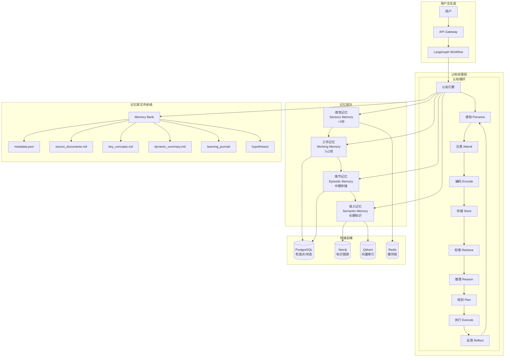
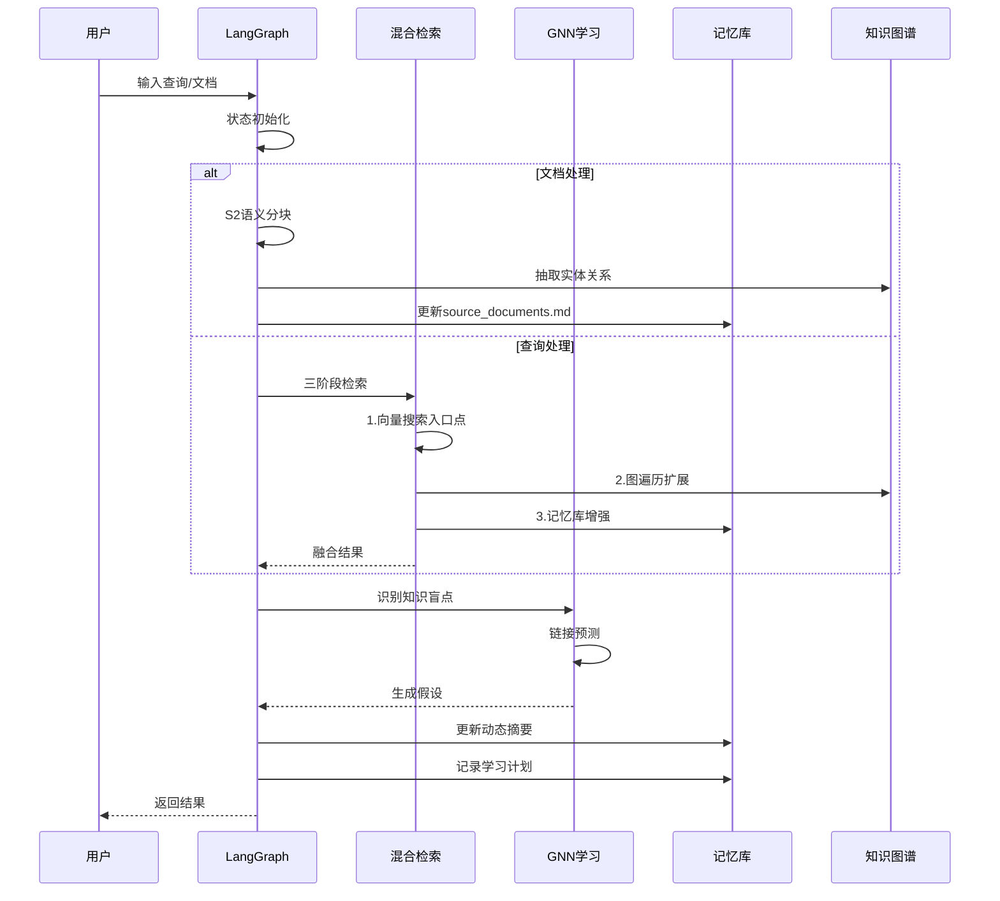
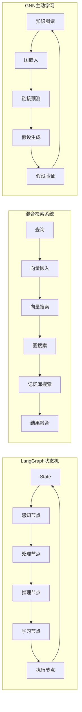
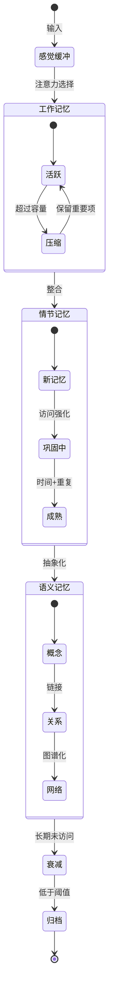
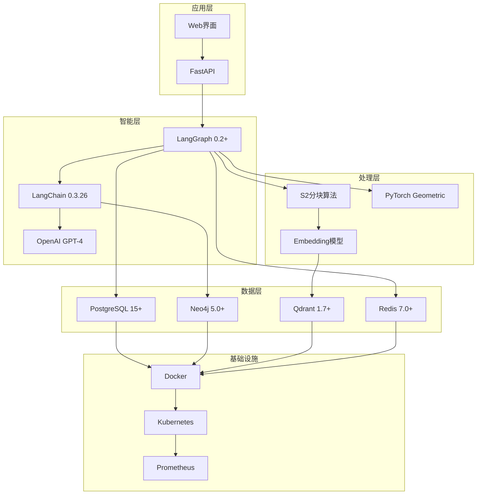
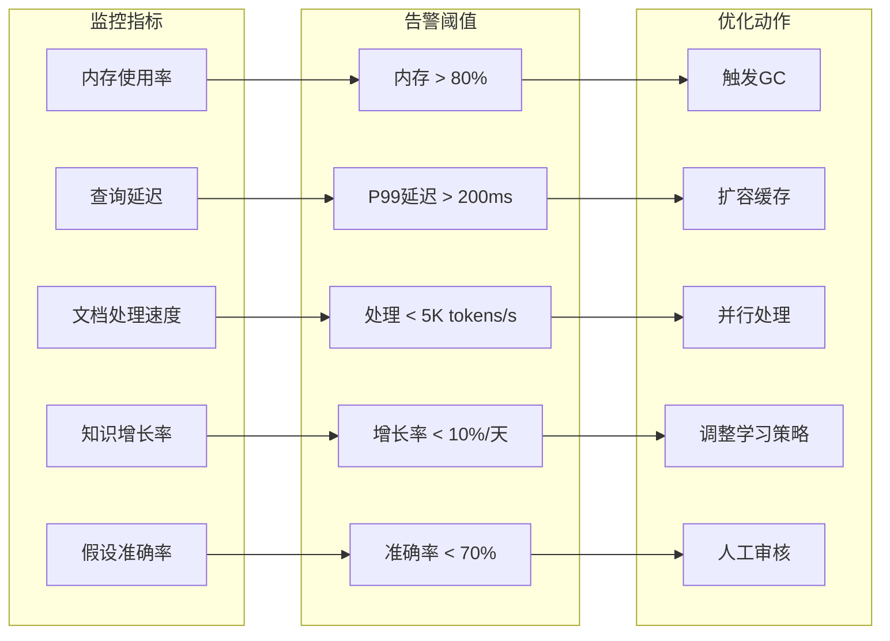
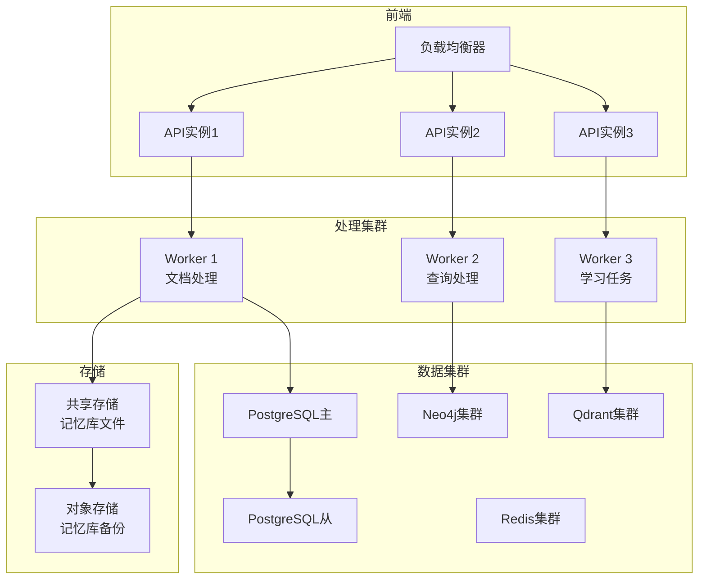

# DPA记忆系统架构图

## 系统总体架构

## 数据流架构

## 核心组件交互

## 记忆生命周期

## 技术栈分层

## 性能指标监控

## 部署拓扑

---

这些架构图展示了DPA记忆系统的：
- 🏗️ **总体架构**：从用户交互到存储后端的完整视图
- 🔄 **数据流程**：文档处理和查询处理的序列
- 🔗 **组件交互**：核心组件之间的协作关系
- 📊 **生命周期**：记忆在不同层次间的流转
- 🛠️ **技术栈**：各层使用的具体技术
- 📈 **监控体系**：性能指标和优化策略
- 🌐 **部署架构**：生产环境的部署拓扑