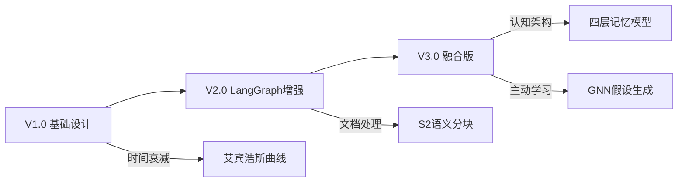

# DPA记忆系统文档索引

## 概述

本目录包含DPA记忆系统的完整设计文档，从初始构想到最终的融合版本，记录了整个设计演进过程。

## 文档列表

### 1. 核心设计文档

#### [MEMORY_SYSTEM_DESIGN_V3_FINAL.md](./MEMORY_SYSTEM_DESIGN_V3_FINAL.md) ⭐
**最终融合版设计（推荐阅读）**
- 融合了LangGraph深度集成和Gemini认知架构理论
- 四层记忆模型（感觉→工作→情节→语义）
- 记忆库（Memory Bank）子系统
- GNN驱动的主动学习
- 完整的技术实现方案

#### [MEMORY_SYSTEM_DESIGN_V2.md](./MEMORY_SYSTEM_DESIGN_V2.md)
**基于LangGraph的增强版**
- LangGraph状态管理
- S2语义分块算法
- 超长文档处理（500K+ tokens）
- 混合检索架构

#### [MEMORY_SYSTEM_DESIGN.md](./MEMORY_SYSTEM_DESIGN.md)
**初始版本设计**
- 多层次记忆架构
- 基础时间衰减机制
- 知识图谱集成
- 个性化推荐

### 2. 评估与风险文档

#### [MEMORY_SYSTEM_EVALUATION.md](./MEMORY_SYSTEM_EVALUATION.md)
**评估框架**
- 功能性评估指标
- 性能基准测试
- 用户体验评估
- 测试数据集设计

#### [MEMORY_SYSTEM_RISKS.md](./MEMORY_SYSTEM_RISKS.md)
**风险评估与缓解**
- 技术风险分析
- 隐私和安全考虑
- 业务风险评估
- 缓解策略

### 3. 实施与参考文档

#### [MEMORY_SYSTEM_IMPLEMENTATION_ROADMAP.md](./MEMORY_SYSTEM_IMPLEMENTATION_ROADMAP.md)
**详细实施计划**
- 8天开发计划
- 技术栈确认
- 测试策略
- 部署架构

#### [MEMORY_SYSTEM_EXECUTIVE_SUMMARY.md](./MEMORY_SYSTEM_EXECUTIVE_SUMMARY.md)
**执行摘要**
- 项目愿景
- 核心创新
- 架构对比
- 预期成果

#### [MEMORY_SYSTEM_QUICK_REFERENCE.md](./MEMORY_SYSTEM_QUICK_REFERENCE.md)
**快速参考指南**
- 核心概念速查
- 快速开始指南
- 常用命令
- 故障排除

## 阅读建议

### 👥 对于管理层
1. 先阅读 [执行摘要](./MEMORY_SYSTEM_EXECUTIVE_SUMMARY.md)
2. 了解 [风险评估](./MEMORY_SYSTEM_RISKS.md)
3. 查看 [实施路线图](./MEMORY_SYSTEM_IMPLEMENTATION_ROADMAP.md)

### 💻 对于开发者
1. 从 [快速参考](./MEMORY_SYSTEM_QUICK_REFERENCE.md) 开始
2. 深入 [最终设计](./MEMORY_SYSTEM_DESIGN_V3_FINAL.md)
3. 参考 [实施路线图](./MEMORY_SYSTEM_IMPLEMENTATION_ROADMAP.md)

### 📊 对于测试人员
1. 重点阅读 [评估框架](./MEMORY_SYSTEM_EVALUATION.md)
2. 了解 [风险缓解](./MEMORY_SYSTEM_RISKS.md)
3. 参考测试策略部分

## 版本演进

## 核心创新总结

### 🧠 认知架构
- 基于认知科学的四层记忆模型
- 完整的认知循环（感知→推理→行动）
- 元认知和自我评估能力

### 🔧 技术突破
- S2语义分块支持超长文档（500K+ tokens）
- 三阶段混合检索（向量→图谱→记忆库）
- GNN驱动的知识补全和假设生成

### 🏗️ 工程实现
- LangGraph状态机驱动的工作流
- PostgreSQL + Neo4j + Redis混合存储
- 人机协作的中断点机制

## 相关资源

- [项目状态](./PROJECT_STATUS.md)
- [技术规格](./TECH_SPEC.md)
- [开发计划](./PHASE2_DEVELOPMENT_PLAN.md)
- [API文档](./API_RATE_LIMIT_AND_VERSIONING.md)

---

📌 **提示**：建议从执行摘要开始，然后根据您的角色选择相应的文档深入阅读。如有疑问，请参考快速参考指南。