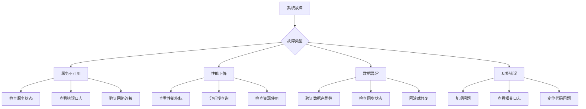

# DPA故障处理手册

## 快速诊断流程

### 1. 问题分类



### 2. 紧急响应步骤

1. **评估影响**
   - 受影响的服务和用户范围
   - 业务影响程度
   - 数据安全风险

2. **快速止损**
   - 隔离故障服务
   - 切换到备用方案
   - 通知相关人员

3. **问题定位**
   - 收集日志和指标
   - 分析根本原因
   - 制定修复方案

4. **恢复服务**
   - 执行修复操作
   - 验证服务状态
   - 监控恢复情况

## 常见问题及解决方案

### 服务启动失败

#### 症状
- Docker容器无法启动
- 服务端口无法访问
- 健康检查失败

#### 诊断步骤
```bash
# 1. 查看容器状态
docker ps -a | grep dpa

# 2. 查看容器日志
docker logs dpa-api --tail=100

# 3. 检查端口占用
netstat -tlnp | grep 8000

# 4. 验证配置文件
docker run --rm -it dpa:latest python -c "from src.config.settings import get_settings; print(get_settings())"
```

#### 常见原因及解决方案

**1. 端口被占用**
```bash
# 查找占用进程
lsof -i :8000

# 终止进程或更改端口
kill -9 <PID>
# 或修改 docker-compose.yml 中的端口映射
```

**2. 环境变量缺失**
```bash
# 检查环境变量
docker exec dpa-api env | grep -E "(DATABASE|REDIS|API)"

# 补充缺失的环境变量
cp .env.template .env
# 编辑 .env 文件
```

**3. 依赖服务未启动**
```bash
# 检查依赖服务
docker-compose ps

# 启动所有服务
docker-compose up -d
```

### 数据库连接问题

#### 症状
- "connection refused" 错误
- "too many connections" 错误
- 查询超时

#### 诊断步骤
```bash
# 1. 测试数据库连接
docker exec dpa-api python -c "
import asyncio
from src.database.postgresql import test_connection
asyncio.run(test_connection())
"

# 2. 检查连接数
docker exec postgres psql -U postgres -c "
SELECT count(*) as total,
       state
FROM pg_stat_activity
GROUP BY state;
"

# 3. 查看慢查询
docker exec postgres psql -U postgres -c "
SELECT pid, now() - query_start as duration, query 
FROM pg_stat_activity 
WHERE state = 'active' 
AND now() - query_start > interval '5 seconds';
"
```

#### 解决方案

**1. 连接池耗尽**
```python
# 增加连接池大小
DATABASE_POOL_SIZE = 30  # 原值 20
DATABASE_MAX_OVERFLOW = 40  # 原值 30

# 或重启应用释放连接
docker-compose restart dpa-api
```

**2. 数据库性能问题**
```sql
-- 分析慢查询
EXPLAIN ANALYZE SELECT ...;

-- 创建缺失索引
CREATE INDEX CONCURRENTLY idx_name ON table(column);

-- 更新统计信息
ANALYZE table_name;

-- 清理死元组
VACUUM ANALYZE table_name;
```

**3. 网络问题**
```bash
# 测试网络连通性
docker exec dpa-api ping rtx4080

# 检查防火墙规则
sudo iptables -L -n | grep 5432

# 重置网络
docker-compose down
docker network prune
docker-compose up -d
```

### API性能下降

#### 症状
- 响应时间增加
- 请求超时
- CPU/内存使用率高

#### 诊断步骤
```bash
# 1. 查看实时性能
docker stats dpa-api

# 2. 分析API日志
grep "duration" /app/logs/app.log | awk '{print $NF}' | sort -n | tail -20

# 3. 检查慢端点
curl http://localhost:9090/api/v1/query?query='histogram_quantile(0.95, http_request_duration_seconds_bucket)'
```

#### 性能优化方案

**1. 增加工作进程**
```dockerfile
# Dockerfile
CMD ["uvicorn", "src.api.main:app", "--workers", "8"]  # 增加工作进程数
```

**2. 启用响应缓存**
```python
from fastapi_cache import FastAPICache
from fastapi_cache.decorator import cache

@router.get("/documents/{doc_id}")
@cache(expire=300)  # 缓存5分钟
async def get_document(doc_id: str):
    return await fetch_document(doc_id)
```

**3. 数据库查询优化**
```python
# 使用批量查询
documents = await session.execute(
    select(Document).where(Document.id.in_(doc_ids))
)

# 添加预加载
query = select(Document).options(
    selectinload(Document.chunks),
    selectinload(Document.metadata)
)
```

### 内存泄漏

#### 症状
- 内存使用持续增长
- OOM错误
- 性能逐渐下降

#### 诊断工具
```python
# 1. 内存分析
import tracemalloc
tracemalloc.start()

# ... 代码执行 ...

snapshot = tracemalloc.take_snapshot()
top_stats = snapshot.statistics('lineno')
for stat in top_stats[:10]:
    print(stat)

# 2. 对象追踪
import gc
import objgraph

# 查看对象数量
objgraph.show_growth()

# 查看引用链
objgraph.show_refs([obj], filename='refs.png')
```

#### 常见原因及修复

**1. 循环引用**
```python
# 问题代码
class Node:
    def __init__(self):
        self.parent = None
        self.children = []
    
# 修复：使用弱引用
import weakref

class Node:
    def __init__(self):
        self._parent = None
        self.children = []
    
    @property
    def parent(self):
        return self._parent() if self._parent else None
    
    @parent.setter
    def parent(self, value):
        self._parent = weakref.ref(value) if value else None
```

**2. 大对象缓存**
```python
# 使用LRU缓存限制大小
from functools import lru_cache

@lru_cache(maxsize=100)
def process_document(doc_id):
    return large_processing_result

# 或使用TTL缓存
from cachetools import TTLCache

cache = TTLCache(maxsize=100, ttl=300)
```

### 数据不一致

#### 症状
- 查询结果不正确
- 数据丢失
- 同步延迟

#### 检查步骤
```sql
-- 1. 检查数据完整性
SELECT COUNT(*) FROM documents d
LEFT JOIN chunks c ON d.id = c.document_id
WHERE c.id IS NULL AND d.status = 'completed';

-- 2. 检查向量索引同步
SELECT COUNT(*) as db_count FROM chunks;
-- 对比 Qdrant 中的向量数量

-- 3. 检查事务状态
SELECT * FROM pg_stat_activity WHERE state = 'idle in transaction';
```

#### 数据修复

**1. 重建索引**
```python
async def rebuild_vector_index():
    # 获取所有文档
    documents = await get_all_documents()
    
    # 重建向量索引
    for doc in documents:
        chunks = await get_document_chunks(doc.id)
        for chunk in chunks:
            embedding = await generate_embedding(chunk.content)
            await qdrant.upsert(
                collection_name="documents",
                points=[{
                    "id": chunk.id,
                    "vector": embedding,
                    "payload": chunk.metadata
                }]
            )
```

**2. 数据同步修复**
```python
async def sync_data():
    # 比对数据
    db_ids = set(await get_all_document_ids())
    vector_ids = set(await qdrant.get_all_ids())
    
    # 找出差异
    missing_in_vector = db_ids - vector_ids
    extra_in_vector = vector_ids - db_ids
    
    # 修复缺失数据
    for doc_id in missing_in_vector:
        await index_document(doc_id)
    
    # 清理多余数据
    for doc_id in extra_in_vector:
        await qdrant.delete(doc_id)
```

## 高级诊断技巧

### 1. 分布式追踪

```python
# 使用 OpenTelemetry 追踪请求
from opentelemetry import trace
from opentelemetry.trace import Status, StatusCode

tracer = trace.get_tracer(__name__)

@app.post("/api/v1/documents")
async def create_document(doc: DocumentCreate):
    with tracer.start_as_current_span("create_document") as span:
        span.set_attribute("document.type", doc.type)
        
        try:
            # 数据库操作
            with tracer.start_as_current_span("db_insert"):
                document = await insert_document(doc)
            
            # 向量化
            with tracer.start_as_current_span("vectorization"):
                await vectorize_document(document)
            
            return document
            
        except Exception as e:
            span.set_status(Status(StatusCode.ERROR, str(e)))
            raise
```

### 2. 性能剖析

```bash
# CPU剖析
py-spy record -o cpu_profile.svg -d 60 --pid $(pgrep -f uvicorn)

# 内存剖析
memray run -o memory_profile.bin python app.py
memray flamegraph memory_profile.bin

# 异步任务分析
python -m asyncio inspect
```

### 3. 网络抓包

```bash
# 抓取API请求
tcpdump -i any -w api_traffic.pcap 'port 8000'

# 分析数据库查询
tcpdump -i any -A 'port 5432' | grep -E "(SELECT|INSERT|UPDATE|DELETE)"

# 使用Wireshark分析
wireshark api_traffic.pcap
```

## 预防措施

### 1. 监控告警

```yaml
# 关键指标监控
- alert: APIErrorRateHigh
  expr: rate(http_requests_total{status=~"5.."}[5m]) > 0.05
  annotations:
    summary: "API错误率超过5%"
    runbook: "https://wiki/runbooks/api-errors"

- alert: DatabaseConnectionsHigh  
  expr: pg_stat_activity_count > 80
  annotations:
    summary: "数据库连接数过高"
    runbook: "https://wiki/runbooks/db-connections"
```

### 2. 容量规划

```python
# 定期收集容量指标
async def collect_capacity_metrics():
    metrics = {
        "total_documents": await count_documents(),
        "storage_used_gb": await get_storage_usage(),
        "avg_document_size_mb": await get_avg_document_size(),
        "daily_growth_rate": await calculate_growth_rate(),
        "projected_capacity_days": await project_capacity()
    }
    
    # 生成容量报告
    generate_capacity_report(metrics)
```

### 3. 灾备演练

```bash
#!/bin/bash
# 灾备演练脚本

# 1. 备份当前数据
./scripts/backup.sh

# 2. 模拟故障
docker-compose stop dpa-api

# 3. 执行恢复
./scripts/restore.sh

# 4. 验证恢复
./scripts/verify_recovery.sh

# 5. 生成演练报告
./scripts/generate_dr_report.sh
```

## 应急联系方式

| 角色 | 责任范围 | 联系方式 |
|------|---------|----------|
| 值班工程师 | 一线响应 | oncall@example.com |
| 系统架构师 | 架构问题 | arch@example.com |
| DBA | 数据库问题 | dba@example.com |
| 安全团队 | 安全事件 | security@example.com |

## 相关资源

- [系统架构图](../diagrams/architecture.png)
- [API文档](https://api.dpa.example.com/docs)
- [运维手册](OPERATIONS_MANUAL.md)
- [监控面板](https://grafana.dpa.example.com)
- [日志查询](https://logs.dpa.example.com)